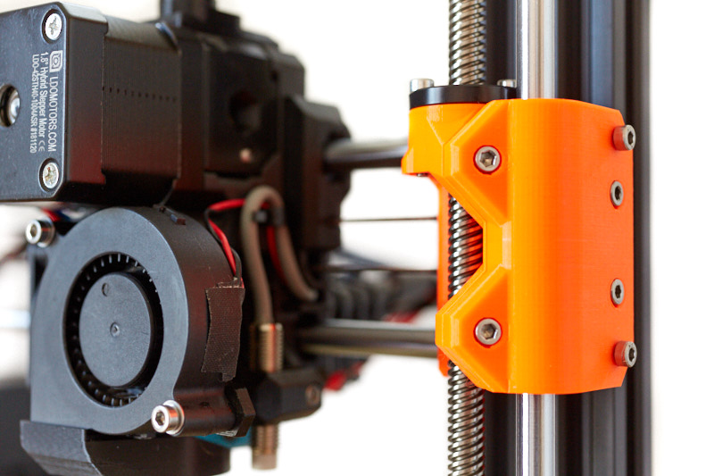
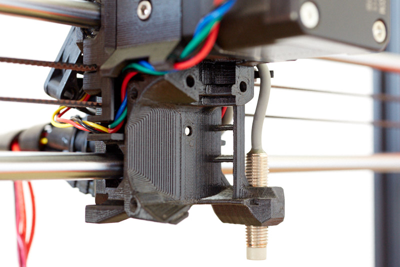
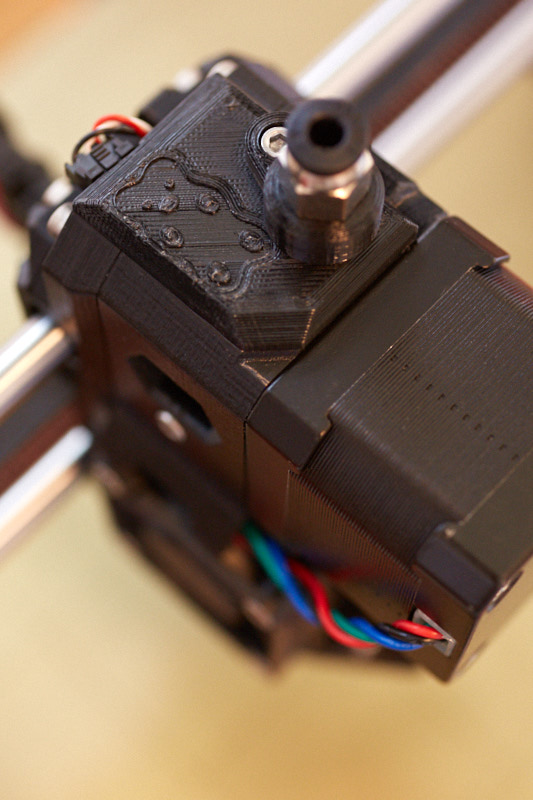
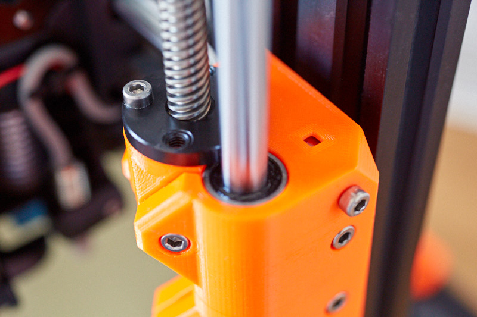
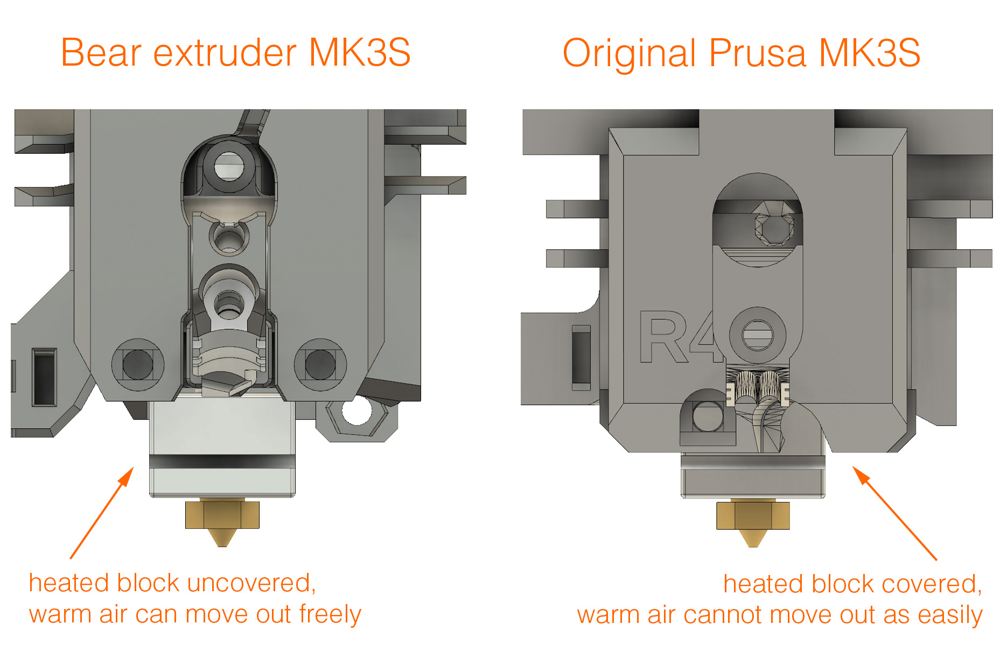

# Bear Extruder And X Axis

## Introduction

This is a better extruder and X axis for Prusa i3 printer MK2.5S and MK3S. It is a following of the [Bear Upgrade project](https://github.com/gregsaun/prusa_i3_bear_upgrade) and is still compatible with original Prusa's 3D printers.

The main goal of this extruder is to improve print quality, reliability and make maintenance easier.

## Features

Here is a list of improved features over stock Prusa extruder.

1. Improve print quality:
   * Better hotend cooling to improve consistency of layers deposition and to reduce clog, heatcreap and stringing (also check these [recommended hotend fans](optional_parts/hotend_fan))
   * Reduce flexing of X axis.
   * Stiffer extruder body to reduce vibration coming from Bondtech gears.
   * Stiffer X axis and several improvements to reduce vibrations.
   * Extruder is closer to X rods to reduce the lever arm and vibration.
   * Bondtech drive gears closer to motor to reduce shaft flexing.
   * Includes hotend collet clip to eliminate the risk of PTFE moving during retractions.
   * More efficient part cooling thanks to nozzle fan duct and bottom shape of extruder.
   * Belt path moved closer to top rod for smoother movements.
   * Filament path is aligned according to Bondtech specifications (check [this issue](https://github.com/prusa3d/Original-Prusa-i3/issues/51)).
   * Optional: X end idler for E3D Gates idler.

1. Easier to maintain:
   * No need to disconnect cables from RAMBo to disassemble the extruder or access the belt.
   * Z bearings installation made easier thanks to clamps.
   * Simple and precise belt tensioning system with 3mm of adjustment.
   * Self-centering of extruder motor.
   * Easy installation and removing of E3D v6 hotend.
   * Easier extruder assembly.
   * No zip ties needed for X carriage bearings.
   * Less screws.

1. Improve reliability:
    * Parts designed to last.
    * Better heat management.
    * Reduce chance to melt extruder body.
    * Vertical print fan to reduce bearing wear and noise.
    * Reduce possible twist on X axis.
    * Reduce chance of bad bearing alignment.
    * Less screws.
    * Extruder body in one piece.

1. Support Prusa MMU2S multi color system via the work of vertigo235: [thingiverse.com/thing:3472911](https://www.thingiverse.com/thing:3472911).
1. Support [Bondtech Prusa Upgrade extruder](https://www.bondtech.se/en/product/prusa-i3-mk2-5-mk3-extruder-upgrade/).
1. Several official and community optional parts.
1. Open source by providing STL and Autodesk Fusion 360 files (STEP file will come later).

## Download printed parts
  * From Thingiverse: 
  * From this GitHub: [printed_parts/stl](printed_parts/)

## Manual

The manual contains bill of materials (BOM), print settings and assembly instructions.

[Read the manual on guides.bear-lab.com](https://guides.bear-lab.com/c/Extruder_X_Axis)

## Optional parts

Official and community optional parts [are here](optional_parts)

## Compatibility

Due to a different belt path, this extruder and X axis are matched to each other __and cannot be used separately__. As a unit, they are compatible with both Original Prusa and Bear Upgrade frames.

  * This Bear extruder version supports the new IR filament sensor introduced with latest Original Prusa MK2.5S/MK3S extruder.
  * This Bear extruder version is compatible with original Prusa firmware for daily use. However, (XY)Z calibration and selftest require a dedicated firmware for these steps only.
  * MK2.5 (non-S) and MK3 (non-S) is compatible with this Bear extruder version with the exception of the filament sensor.

In an effort to lengthen the Z axis, the original Prusa MK2.5S/MK3S hotend was raised by about 7 mm. This placement increases the ambient temperature around heatbreak and heatblock which leads to clogging, heatcreep, inconsistent layers, extruder body melting, reducing part cooling efficiency, longer retractions, etc.

We then have decided to keep the same position of our previous Bear extruder to provide best printing experience and reliability. Because of the difference with original Prusa extruder, we provide a customized firmware to pass Selftest and (XY)Z Calibration. At the exception of these steps, the original Prusa firmware is completely compatible with our extruder.

The firmware is available here: https://github.com/bear-lab-3d/Prusa-Firmware/releases/

## Community

Here are the places were the Bear project is the most active. Do not hesitate to ask if you have a question :

* Facebook group : [facebook.com/groups/PrusaBearUpgrade](https://www.facebook.com/groups/PrusaBearUpgrade)
* Discord server of "The 602 Wasteland" community : [discordapp.com/invite/hYUjSnW](https://discordapp.com/invite/hYUjSnW)
* GitHub : [github.com/gregsaun](https://github.com/gregsaun)
* Thingiverse : [thingiverse.com/pekcitron](https://www.thingiverse.com/pekcitron)
* Openbuilds community : [openbuilds.com/builds/prusa-i3-bear-upgrade-v2.6428](https://openbuilds.com/builds/prusa-i3-bear-upgrade-v2.6428/)

## Images

## Support my work

The Bear project is made possible thanks supporters. Here are some way to support me:
  - Become my patron with Patreon: [patreon.com/gregsaun](https://www.patreon.com/gregsaun)
  - A tip via Paypal: [paypal.me/gregsaun](https://www.paypal.me/gregsaun)
  - A tip via Thingiverse: [thingiverse.com/pekcitron](https://www.thingiverse.com/pekcitron/about)

Big thank you in advance :heart:

## Thank you

Thank you to all my Patreon : Sleene, Matthew Humphrey, Greg3D, robert veline, Loïc Dumont, Keith Beaul, Stefan Hilbrich, Gareth Brown, Skyler Weinkauf, Grigori Palamartšuk, Stanislav Kljuhhin, Evan, SamE0717, Peter Boardman, Jimmy Lee, Erich Jermann, Miguel Castillo, Scott Rini, Anders Svendsen, Arnaud CHRISTEL, Tom Kogut, Edward Wright, David Tyra, mark smith, Andrew Bingham, Lewis Cheek, Brian Tibbetts, Mike Phelps, Kevin Smith, 3D-Maniac, Ted Rathkopf, JTa, flobler, Jonathan Ryer, Nathan Trop, Ryan Lobbins, Corey Dryja, Bearpaw93, David Pesce, RC-CnC, Joshua Jones, Richard Bateman, Christopher Lee, Josh Carter, Cristian Toma, Orlando E Moran, Evgen, Tomáš Vydra, Hector Gonzalez, Ahmed, Patch Best, Tyler Townes, QcRetro, Joel Weinberg, ra100, Steven Daglish, 3DPrintronics, Darren Furniss, Daniele Malinconi, Nicolas Pottier, Warren Schultz, Joseph Quan, Staffsmith aka Thorben Plath, Stephen Pope, Andre, Austin Vojta, Thom Sturgill, Chris Warkocki, Bojan Kopanja, Garth Clardy, Pierre Allegraud, Joan Torner Corrons, Jason Marcus, Albe Gouws, Stephan Kohls, Doug Palmer, Total Dramatist, Apton Ika, Moody Wood Carving, Espen Fjellvær Olsen, Christos Goulas.

Thank you to David Ogles, Flobler, Jason from LDO Motors, Matthew Humphrey, Nathan Denkin, Orlando from All3DMakers, Saiz, Sleene, Termlimit, Vertigo295 for helping me developing the Bear project.

Thank you to all that have send me a tip on Thingiverse and PayPal.

Thank you to everybody from Facebook group and The 602 Wasteland community.

Thank you for having purchased a kit from an official distributor.

Thank you to all official distributors for taking care of the kits and customers.

Thank you Jason from LDO Motors for the quality manufacturing and relationship.

Thank you Openbuilds for your hardware, community and state of mind.

Thank you for making the community alive with all your comments, issues, pull requests, optional parts, make, pictures, etc.

## Credit, sources and inspiration

Here is a list of sources and inspiration :

* Prusa : http://www.prusa3d.com
* Vecko Kojchevski for the help on some details of the X end clamps, X carriage and PTFE cutter : https://www.thingiverse.com/vekoj/designs
* Arnaud Rousseau for "its X-Ends clamped MK3 (Zaribo)" : https://www.thingiverse.com/thing:2964026
* Prusa i3 Solidworks parts from jzkmath : https://github.com/jzkmath/Original-Prusa-i3
* Prusa MK2/S X-Carriage Adjustable Tensioner by Jon Madden : https://www.thingiverse.com/thing:2770019
* Jan Imrich from [Kurzy Kocour](https://www.facebook.com/KurzyKocour/) maker space for all it's hard work on inconsistency issue
* The 602 Wasteland Discord community for their precious knowledge and advices
* [RH_Dreambox](https://www.thingiverse.com/RH_Dreambox/about) and [Robrps](https://www.thingiverse.com/robrps/designs) for their nozzle fan duct designs
* Joel from [Bondtech](https://www.bondtech.se/en/product/prusa-i3-mk2-5-mk3-extruder-upgrade/) for having pushed me to pursue the filament sensor idea

Massive thanks to these projects, without them this project can not exist!
