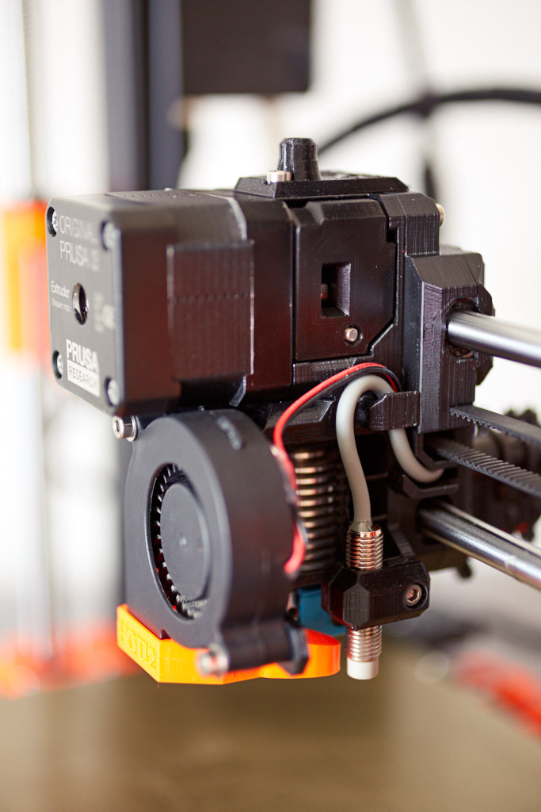
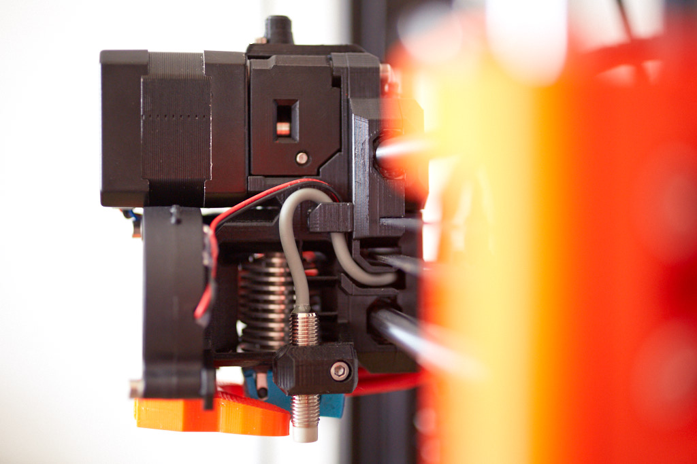
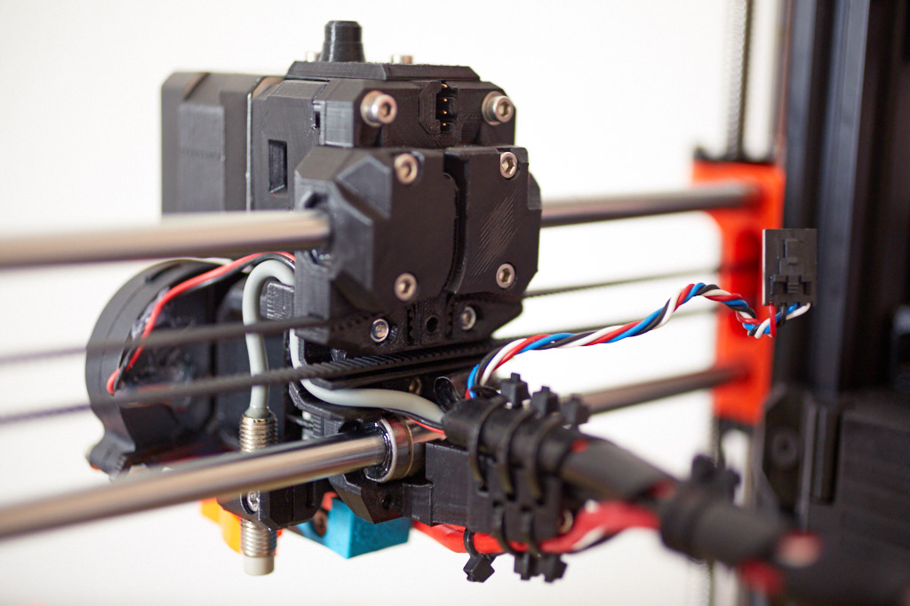
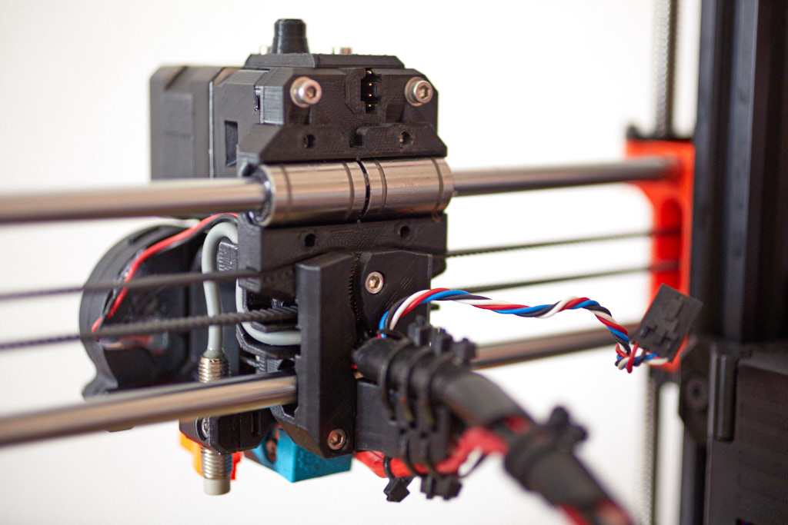
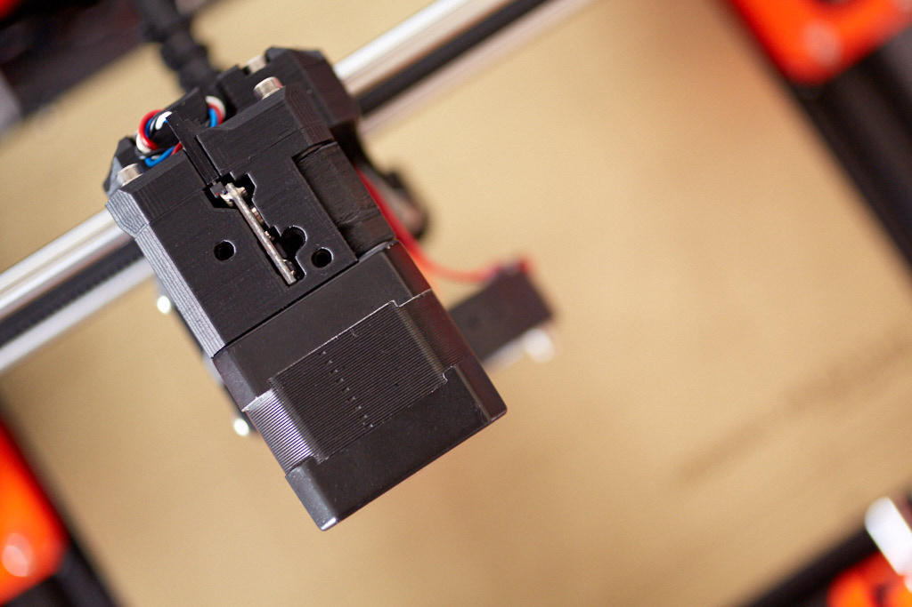
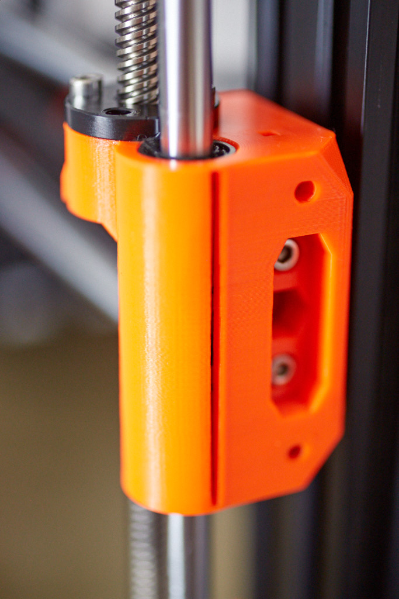

# Bear Extruder And X Axis

## Introduction

This is a better extruder and X axis for Prusa i3 printer MK2(s), MK2.5 and MK3. It is a following of the Prusa's printers improvements I started few months ago with my [Bear Upgrade project](https://github.com/gregsaun/prusa_i3_bear_upgrade)

## Features

Here is a list of improved features over stock Prusa extruder.

### Already implemented

1. Lighter
1. Extruder motor is closer by 4.5mm to X rods (decrease the lever arm)
1. X ends and extruder are much stiffer
1. Reduce inconsistent extrusion : 
   * Perfect filament path (check [this issue](https://github.com/prusa3d/Original-Prusa-i3/issues/51))
   * Extruder body is much stiffer
   * Optional: use bearing instead of Bondtech "idler" gear to reduce gear meshing issue. See [optional parts](optional_parts/)
   * Hotend cooling improved (even better than Prusa MK3 R3 parts)
   * Self-centring of extruder motor
   * Bondtech drive gears no more at the end of the motor shaft
   * Includes hotend collet clip
1. Easier to maintain : 
   * No need to disconnect cables from RAMBo to disassemble the extruder or access the belt
   * No zip ties needed for X carriage bearings
   * Belt tensioning system easier to ease
   * Less screws
1. Perfect belt alignment
1. Belt path closer to top smooth rod to reduce vibration
1. Include a tool to insert Z bearing easily
1. Open source by providing STL and Autodesk Fusion 360 files

### Ongoing

1. Try to move motor even closer
1. Create MK3 and MK2s version
1. Provide STEP files

## Status

:warning: This is an ongoing development, not even a beta version for now. Use it with care. Any feedback is very welcome :relaxed:

## Manual

The manual contains bill of material (BOM), print settings and assembly instructions.

[Read it here](manual/)

## Compatibility

:warning: Original extruder and X axis is **NOT** compatible with this project! Belt path, X motor position, screws positions and length (...) differ.

## Images

## Sources and inspiration

Here is a list of sources and inspiration :

* Prusa : http://www.prusa3d.com
* Zaribo : http://zaribo.org
* Vecko Kojchevski : https://www.thingiverse.com/vekoj/designs
* Prusa i3 Solidworks parts from jzkmath : https://github.com/jzkmath/Original-Prusa-i3
* Prusa MK2/S X-Carriage Adjustable Tensioner by Jon Madden : https://www.thingiverse.com/thing:2770019
* Jan Imrich from [Kurzy Kocour](https://www.facebook.com/KurzyKocour/) maker space for all it's hard work on issue #602
* The 602 Wasteland Discord server

Huge thanks to these projects, without them this project can not exist!
