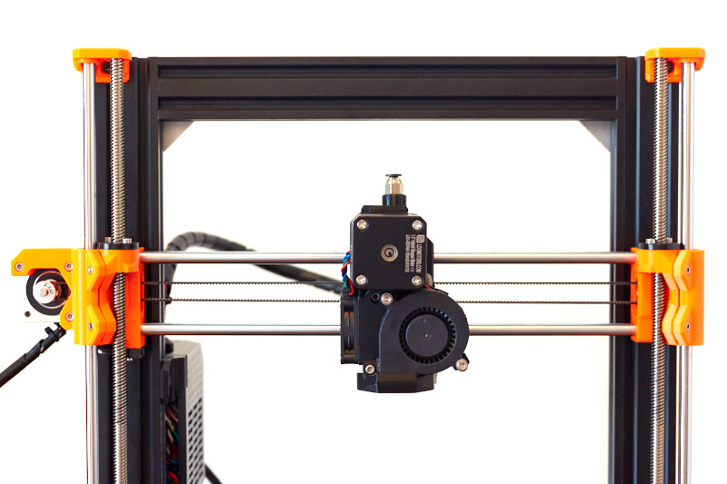
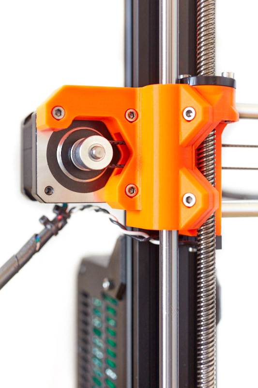
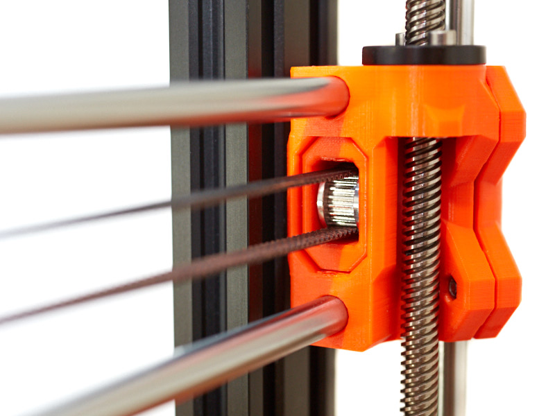
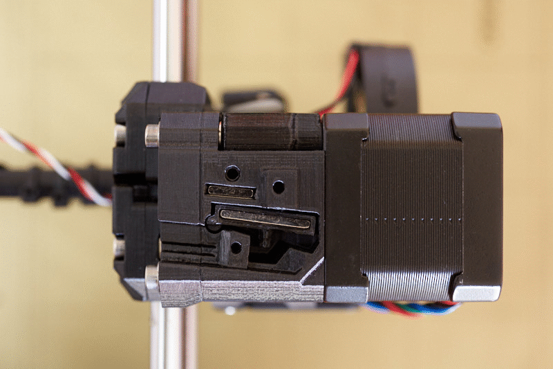

# Bear Extruder And X Axis

## Table of contents
  1. [Introduction](#introduction)
  1. [Features](#features)
  1. [Compatibility](#compatibility)
  1. [Download printed parts](#download-printed-parts)
  1. [Manual](#manual)
  1. [Optional parts](#optional-parts)
  1. [Community](#community)
  1. [Images](#images)
  1. [Support my work](#support-my-work)
  1. [Thank you](#thank-you)
  1. [Credit, sources and inspiration](#credit-sources-and-inspiration)

## Introduction

This is an extruder and X axis for Prusa i3 printer that improve print quality, reliability and make maintenance easier. It is a following of the [Bear Upgrade project](https://github.com/gregsaun/prusa_i3_bear_upgrade) but also compatible with original Prusa's 3D printers.

The Bear X axis also supports alternative extruders such as [Bondtech Prusa Upgrade](./optional_parts/bondtech_x_carriage), [E3D Hemera](./optional_parts/bear_hemera) and [Vertigo295's extruders](https://www.thingiverse.com/vertigo235/designs).

:warning: The Bear X axis is **NOT** compatible with stock Prusa extruder!

## Features

The Bear X axis and extruder are not only improving print quality but they are also designed to last and to make maintenance and assembly easier. All our designs comes with complete manual with clear assembly instructions.

The Bear X axis also support alternative extruders from Bondtech, E3D and Vertigo295.

All parts are available under GPLv3 open source license and you can download STEP and Fusion 360 source files. Feel free to fork and share it!

### Bear X axis (and X carriage)

  * Stiffer X axis to reduce ringing
  * Simple and precise belt tensioning system
  * Z bearings installation made easier thanks to clamps
  * Support MK2.5S/MK3S IR filament sensor
  * Belt path optimized for smoother movements
  * X carriage makes access to extruder's cables easier
  * X carriage improves X bearing alignment
  * Self centering of X motor thanks to kinematic constraint
  * Optional: Support alternative extruders
  * Optional: X end idler for E3D Gates idler

### Bear extruder

  * Better heat management to reduce inconsistency, clogs, heatcreap and stringing (also check these [recommended hotend fans](optional_parts/hotend_fan))
  * Stiffer extruder thanks to a uni-body structure
  * More efficient part cooling
  * Perfect filament path alignment
  * Self-centering of extruder motor
  * Easy installation and removing of E3D v6 hotend
  * Reduce vibrations of the extruder and Bondtech gears
  * Vertical print fan to reduce bearing wear and noise
  * Optional: Compatible with MMU2(S) thanks to the work of Vertigo295

### Alternative extruders (optional)

The Bear X axis is also compatible with the following alternative extruders.

See [optional parts](optional_parts/) to get all information and files about those alternative extruders.

  * [E3D Hemera](https://e3d-online.com/e3d-hemera-175-kit)
  * [Bondtech Prusa Upgrade extruder](https://www.bondtech.se/en/product/prusa-i3-mk2-5-mk3-extruder-upgrade/)
  * [Bear extruder for MMU2S by vertigo235](https://www.thingiverse.com/thing:3472911)
  * [Gear box for Bear extruder by vertigo235](https://www.thingiverse.com/thing:3714978)

## Compatibility

Due to a different belt path, the Bear X axis and extruders are matched to each other __and cannot be used separately__. As a unit, they are compatible with both Original Prusa frame and Bear Upgrade frames.

  * The Bear extruder version supports the new IR filament sensor introduced with latest Original Prusa MK2.5S/MK3S extruder.
  * The Bear extruder version is compatible with original Prusa firmware for daily use. However, (XY)Z calibration and selftest require a dedicated firmware for these steps only.
  * MK2.5 (non-S) and MK3 (non-S) is compatible with this Bear extruder version with the exception of the filament sensor.

In an effort to lengthen the Z axis, the original Prusa MK2.5S/MK3S hotend was raised by about 7 mm. This placement increases the ambient temperature around heatbreak and heatblock which could leads to print quality and reliability issues. We then have decided to not lengthen the Z axis in order to provide best printing experience. Because of this difference with original Prusa extruder, we provide a customized firmware to pass Selftest and (XY)Z Calibration. At the exception of these steps, the original Prusa firmware is completely compatible with our extruder.

The firmware is available here: https://github.com/bear-lab-3d/Prusa-Firmware/releases/

## Download printed parts

Direct links to download Bear extruder and X axis (zip file) :
* Bear extruder and X axis MK2.5S : [bear_extruder_x_axis_mk25s.zip](https://github.com/gregsaun/bear_extruder_and_x_axis/raw/master/printed_parts/bear_extruder_x_axis_mk25s.zip)
* Bear extruder and X axis MK3S : [bear_extruder_x_axis_mk3s.zip](https://github.com/gregsaun/bear_extruder_and_x_axis/raw/master/printed_parts/bear_extruder_x_axis_mk3s.zip)
* Sources : [bear_extruder_x_axis_sources.zip](https://github.com/gregsaun/bear_extruder_and_x_axis/raw/master/printed_parts/bear_extruder_x_axis_sources.zip)

You can also download them via Thingiverse: [thingiverse.com/thing:3716110](https://www.thingiverse.com/thing:3716110)

## Manual

The manual contains bill of materials (BOM), print settings and assembly instructions.

[Read the manual on guides.bear-lab.com :book:](https://guides.bear-lab.com/c/Extruder_X_Axis)

## Optional parts

Here is a list of optional parts for the Bear extruder and X axis.

| Description | Link |
|-------------|------|
| E3D Hemera mount (BearMera) | [bear_hemera](optional_parts/bear_hemera) |
| X carriage for Bondtech extruder | [bondtech_x_carriage](optional_parts/bondtech_x_carriage) |
| Hotend fan (Sunon / Delta) | [hotend_fan](optional_parts/hotend_fan) |
| X end tensioner for E3D idlers | [x_end_idler_tensioner_e3d](optional_parts/x_end_idler_tensioner_e3d) |
| Reverse bowden adapters | [reverse_bowden](optional_parts/reverse_bowden) |
| X carriage back for larger filament sensor cable |[x_carriage_back_larger_cable](optional_parts/x_carriage_back_larger_cable) |

You can also find optional parts made by the community at [guides.bear-lab.com/Wiki/community_optional_parts](https://guides.bear-lab.com/Wiki/community_optional_parts).

## Community

Here are the places were the Bear project is the most active. Do not hesitate to ask if you have a question :

* Facebook group : [facebook.com/groups/PrusaBearUpgrade](https://www.facebook.com/groups/PrusaBearUpgrade)
* Discord server of "The 602 Wasteland" community : [discordapp.com/invite/hYUjSnW](https://discordapp.com/invite/hYUjSnW)
* Twitter : [@gregoiresaunier](https://twitter.com/gregoiresaunier)
* GitHub : [github.com/gregsaun](https://github.com/gregsaun)
* Thingiverse : [thingiverse.com/pekcitron](https://www.thingiverse.com/pekcitron)

## Images

## Support my work

The Bear project is made possible thanks supporters, you can participate via
  
 [patreon.com/gregsaun](https://www.patreon.com/gregsaun)
  
 [paypal.me/gregsaun](https://www.paypal.me/gregsaun)
  
 You can also send me a tip via [Thingiverse](https://www.thingiverse.com/pekcitron/about) if you prefer that way.

Massive thank you in advance :heart:

## Thank you

Thank you to all my Patreon : 3D-Maniac, 3DPrintronics, Aaron Rieley, Ahmet Kocamese, Aki Juntunen, Alex Vasile, Anders Svendsen, Andrew Bingham, Asbjorn Mikkelsen, Austin Vojta, Bas Borgignons, Bastian Sembdner-Braun, Ben Langley, Bob Collinsworth, Borja Gutierez Yañez, Brad Craig, Brad Marreno, Carlos Varas, Chip, Chris Jackson, Chris Theberge, Chris Warkocki, Chris, Christopher Lee, Christos Goulas, Corey Dryja, Corrado, Cowen, Cristian Toma, D4rkH0ur, Danger Mause, Daniel Zittel, darkly spectre aka that one belgian cunt, Darren Furniss, David F Morrison II, David Pesce, David Tyra, Dejan Vozlic, Dominik Hahn, Doug Palmer, Doug Robertson, Dustin Lehmann, Elendil the tall, Emiliano Vignali, Eric Mathison, Erich Jermann, Ethan D Goodsell, Evan, Evgen, Fabian Bruse, Fake Patreon, Felix Ekman, Filament Frenzy, Filip Hronek, flobler, Garth Clardy, Gerd Jentz, Glen Brown, Greg3D, Grigori Palamartšuk, Harrison, Hector Gonzalez, Hobby Hoarder, Hugo Henry-garon, I've Seen Things, Illia Tsariuk, J.D. sloot, jac shakeab, Jacek Owczarek, Jack Emilsen, Jacob Leonard, Jake Hamlin, James ballan, Jan Andersen, Jason Bao, Jason Marcus, Jay Davis, JD, Jesper, Jim Jacques, Jimmy Lee, Joan Torner Corrons, Joe Mike T, Joel Weinberg, Jonathan Ryer, Joseph Quan, Josh Carter, Josheua R Mascote, Joshua Jones, JTa, Juan Rosario, Keith Beaul aka ciscokeb, Ken Waters, Kevin Smith, Kevin Tapper, Kim Schauss, Kristof Spiszak, Laurent Zender, Loïc Dumont, Magnus Pfeffer, Marc, Marie Barada Saunier, Mark Griesi, Markku Sinisalo, maroonds, Martin Majewski, Megan Cooper, Melissa LeBlanc-Williams, Merijn van Mourik, Michal Kapusnik, Miguel Castillo, Mike An, Mike Phelps, Moody Wood Carving, Morgan Jonasson, Name, Narasak Mansurang, Nawaf Al-Abdulrazak, Neofitos Papadopoulos, Nicholas Christopoulos, Nicolas Pottier, Orlando E Moran, Oscar Padilla, Owe Brekken, Palko Kupecz, Patrick Glyré, Patrick Hung, Patrick Wong, Peter Kelly, Peter Sanders, Phil S., Phillip Hartley, Przemek, QcRetro, ra100, Rasmus Baes, RC-CnC, Richard Bateman, robert veline, Rodney Ford, Ronny Olsen, Rubens Panfili, Ryan Lenny, Ryan Lobbins, SamE0717, Satoshi Takanashi, Scott Rini, Serkan Aksu, Settle, Shane Wallner, Shawn Chronister, Shawn England, Skyler Weinkauf, sleene, Staffsmith aka Thorben Plath, Stanislav Kljuhhin, Stephan Kohls, Stephen Pope, Steve Carter, Steve Peterson, Steven Daglish, Stian Aronsen, Stig Jøran Moen, Stuart Galloway, Stuflo, Ted Marsh, Ted Rathkopf, ThatIrishSOB, Thom Sturgill, Thomas Tuchan, Timothy Franke, tinyledmatrix, Toby @ 3D GeeksApp, Tom Kogut, Total Dramatist, Trae LaPole, Tyler Townes, Valentin Constantin, Valeria, Víctor Martínez, Warren Schultz, Wes Warner, Yann Gosteli.

Thank you to David Ogles, Flobler, Jason from LDO Motors, Matthew Humphrey, Nathan Denkin, Orlando from All3DMakers, Saiz, Sleene, Termlimit, Vertigo295 for helping me developing the Bear project.

Thank you to all that have send me a tip on Thingiverse and PayPal.

Thank you to everybody from Facebook group and The 602 Wasteland community.

Thank you for having purchased a kit from an official distributor.

Thank you to all official distributors for taking care of the kits and customers.

Thank you Jason from LDO Motors for the quality manufacturing and relationship.

Thank you Openbuilds for your hardware, community and state of mind.

Thank you for making the community alive with all your comments, issues, pull requests, optional parts, make, pictures, etc.

## Credit, sources and inspiration

Here is a list of sources and inspiration :

* Prusa : http://www.prusa3d.com
* Vecko Kojchevski for the help on some details of the X end clamps, X carriage and PTFE cutter : https://www.thingiverse.com/vekoj/designs
* Arnaud Rousseau for "its X-Ends clamped MK3 (Zaribo)" : https://www.thingiverse.com/thing:2964026
* Prusa i3 Solidworks parts from jzkmath : https://github.com/jzkmath/Original-Prusa-i3
* Prusa MK2/S X-Carriage Adjustable Tensioner by Jon Madden : https://www.thingiverse.com/thing:2770019
* Jan Imrich from [Kurzy Kocour](https://www.facebook.com/KurzyKocour/) maker space for all it's hard work on inconsistency issue
* The 602 Wasteland Discord community for their precious knowledge and advices
* [RH_Dreambox](https://www.thingiverse.com/RH_Dreambox/about) and [Robrps](https://www.thingiverse.com/robrps/designs) for his nozzle fan duct designs
* Joel from [Bondtech](https://www.bondtech.se/en/product/prusa-i3-mk2-5-mk3-extruder-upgrade/) for having pushed me to pursue the filament sensor idea

Massive thanks to these projects, without them this project can not exist!
