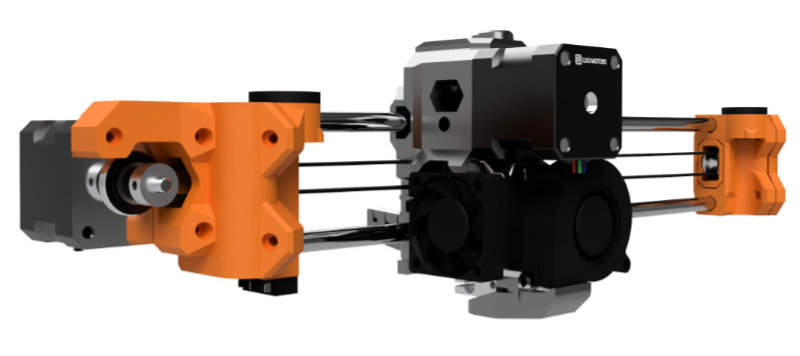
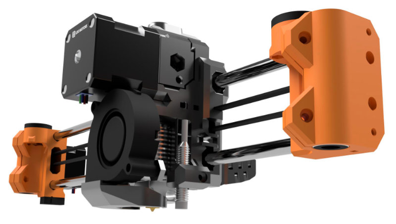
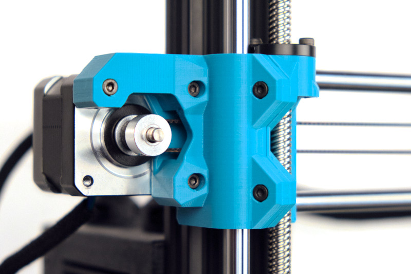
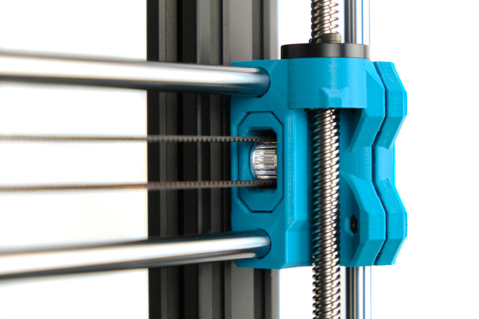
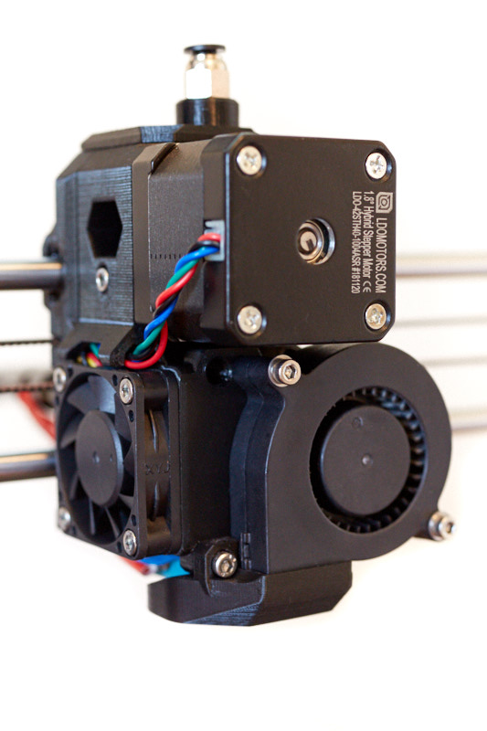
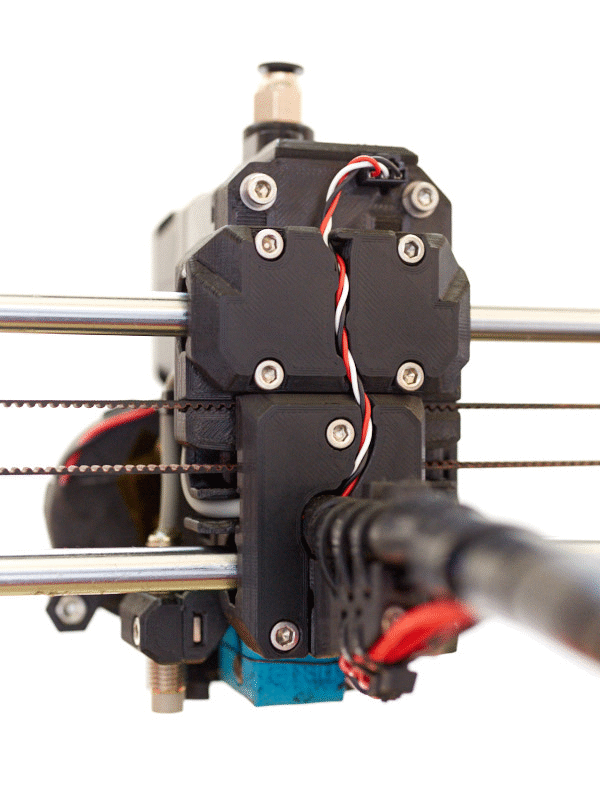
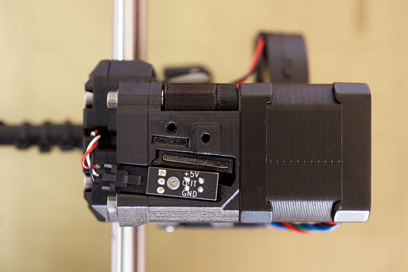
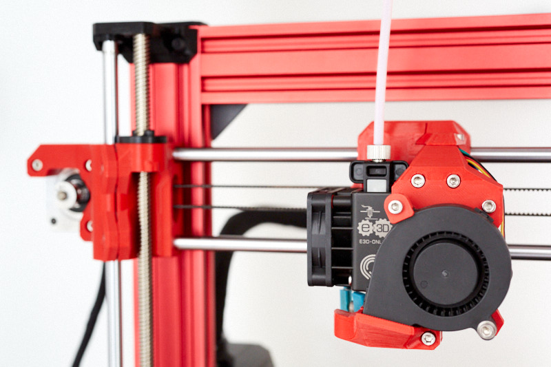

# Bear Extruder And X Axis (BearExxa)

## Table of contents
  1. [Introduction](#introduction)
  1. [Features](#features)
  1. [Compatibility](#compatibility)
  1. [Printed parts](#Printed-parts)
  1. [Manual](#manual)
  1. [Optional parts](#optional-parts)
  1. [Community](#community)
  1. [Images](#images)
  1. [Source](#source)
  1. [Support my work](#support-my-work)
  1. [Thank you](#thank-you)
  1. [License](#license)
  1. [Credit and inspiration](#credit-and-inspiration)

## Introduction

The BearExxa (Bear extruder and X axis) is an alternative extruder and X axis for Prusa i3 printer and is designed to improve print quality, reliability and ease of maintenance. It is following the [Bear Upgrade project](https://github.com/gregsaun/prusa_i3_bear_upgrade) but also compatible with Original Prusa's MK2(S) and MK3(S) frames.

The Bear X axis also supports alternative extruders such as [Bondtech Prusa Upgrade](./optional_parts/bondtech_x_carriage), [E3D Hemera](./optional_parts/bear_hemera) and [vertigo235's extruders](https://www.thingiverse.com/vertigo235/designs).

All parts are available under the GPLv3 open source license and you can download STEP source files. Feel free to fork and share!

:warning: The Bear X axis is **NOT** compatible with stock Prusa extruder!

## Features

### Bear X axis (and X carriage)

  * Simple and precise belt tensioning system
  * Stiffer X axis design to reduce ringing
  * Easier Z bearings installation thanks to clamping system
  * Optimized belt path for smoother movements
  * Easy access to belt and extruder cables
  * Improved X axis bearing alignment
  * Kinematic constraint to self-center the X stepper
  * Optional: Support for alternative extruders
  * Optional: Compatible with E3D Gates idlers

### Bear extruder

  * Better heat management to reduce inconsistency, clogs and heatcreap (also check these [recommended hotend fans](optional_parts/hotend_fan))
  * Stiffer extruder thanks to a uni-body structure
  * Easier installation and removal of E3D v6 hotend
  * Efficient part cooling
  * Self-centering of extruder motor and Bondtech gears
  * Reduced risk of [extruder blob](https://www.prusa3d.com/extruder-blob/)
  * Reliable filament sensor (based on MK2.5S/MK3S sensor)
  * Perfectly aligned filament path
  * Reduced extruder and Bondtech gear vibrations
  * Reduced wear and noise of print fan thanks to a vertical assembly
  * Optional: Compatible with MMU2S thanks to the work of [vertigo235](https://www.thingiverse.com/vertigo235/designs)

### Alternative extruders (optional)

The Bear X axis is also compatible with several alternative extruders. See [optional parts](optional_parts/) to get all the information and files for those alternative extruders.

  * [E3D Hemera](optional_parts/bear_hemera)
  * [Bondtech Prusa Upgrade extruder](optional_parts/bondtech_x_carriage)
  * [Bear extruder for MMU2S by vertigo235](https://www.thingiverse.com/thing:3472911)
  * [Gear box for Bear extruder by vertigo235](https://www.thingiverse.com/thing:3714978)
  * [Bear Extruder BLTouch Mount by vertigo235](https://www.thingiverse.com/thing:3251530)

## Compatibility

Due to a different belt path, the Bear X axis and extruders are matched to each other __and cannot be used separately__. As a unit, they are compatible with both Original Prusa frames and Bear Upgrade frames.

  * The Bear extruder version supports the new IR filament sensor introduced with the latest Original Prusa MK2.5S/MK3S extruder.
  * The Bear extruder version is compatible with original Prusa firmware for daily use. However, (XY)Z calibration and selftest require a dedicated firmware for these steps only.
  * MK2.5 (non-S) and MK3 (non-S) are compatible with this Bear extruder version with the exception of the filament sensor.

In an effort to lengthen the Z axis, the original Prusa MK2.5S/MK3S hotend was raised by [about 6mm](doc/prusa_mk3_mk3s_size_diff_01.jpg). This placement increases the ambient temperature around heatbreak and heatblock which could lead to print quality and reliability issues. We have decided to not lengthen the Z axis in order to provide best printing experience. Because of this difference with the original Prusa extruder, we provide a customized firmware to pass Selftest and (XY)Z Calibration. Except for these steps, the original Prusa firmware is completely compatible with our extruder.

The firmware is available here: https://github.com/bear-lab-3d/Prusa-Firmware/releases/

## Printed parts

Download links for the Bear extruder and X axis (BearExxa) :
* BearExxa MK2.5S : [bear_extruder_x_axis_mk2.5s.zip](printed_parts/bear_extruder_x_axis_mk2.5s.zip?raw=true)
* BearExxa MK3S : [bear_extruder_x_axis_mk3s.zip](printed_parts/bear_extruder_x_axis_mk3s.zip?raw=true)
* Sources : [bear_extruder_x_axis_source.zip](source/bear_extruder_x_axis_source.zip?raw=true)

You can also download them via Thingiverse: [thingiverse.com/thing:3716110](https://www.thingiverse.com/thing:3716110)

If you are looking for alternative extruders printed parts, please check the section [Optional parts](#optional-parts) below.

## Manual

The manual contains bill of materials (BOM), print settings and assembly instructions.

[Read the manual on guides.bear-lab.com :book:](https://guides.bear-lab.com/c/95jghwzvw9l46s3g)

## Optional parts

Here is a list of optional parts designed for the Bear extruder and X axis (BearExxa).

| Description | Link |
|-------------|------|
| E3D Hemera mount (BearMera) | [bear_hemera](optional_parts/bear_hemera) |
| X carriage for Bondtech extruder | [bondtech_x_carriage](optional_parts/bondtech_x_carriage) |
| Hotend fan (Sunon / Delta) | [hotend_fan](optional_parts/hotend_fan) |
| X end tensioner for E3D idlers | [x_end_idler_tensioner_e3d](optional_parts/x_end_idler_tensioner_e3d) |
| Reverse bowden adapters | [reverse_bowden](optional_parts/reverse_bowden) |
| X carriage back for larger filament sensor cable |[x_carriage_back_larger_cable](optional_parts/x_carriage_back_larger_cable) |

You can also find optional parts made by the community at [guides.bear-lab.com/Wiki/community_optional_parts](https://guides.bear-lab.com/Wiki/community_optional_parts).

## Community

Here are the places were the Bear project is the most active. Do not hesitate to ask if you have a question :

* Facebook group : [facebook.com/groups/PrusaBearUpgrade](https://www.facebook.com/groups/PrusaBearUpgrade)
* Discord server of "The 602 Wasteland" community : [discordapp.com/invite/hYUjSnW](https://discordapp.com/invite/hYUjSnW)
* Twitter : [@gregoiresaunier](https://twitter.com/gregoiresaunier)
* GitHub : [github.com/gregsaun](https://github.com/gregsaun)

## Images

> Pictures from Flobler and Grégoire Saunier

## Source

All source files in Fusion 360 and STEP format can be [download here](source/bear_extruder_x_axis_source.zip?raw=true).

## Support my work

The Bear project is only possible thanks its supporters, you can participate via
  
 [patreon.com/gregsaun](https://www.patreon.com/gregsaun)
  
 [paypal.me/gregsaun](https://www.paypal.me/gregsaun)
  
 You can also send me a tip via [Thingiverse](https://www.thingiverse.com/pekcitron/about) if you prefer.

Massive thank you in advance :heart:

## Thank you

First of all, massive thank you to [Adrian Bowyer](https://github.com/AdrianBowyer/) for having invented [RepRap](http://reprapltd.com).

Thank you to all my Patreon's : 3D-Maniac , 3DPrintronics , Aaron Rieley, Ahmet Kocamese, Albe Gouws, Alex Vasile, Anders Svendsen, Andrew Bingham, Asbjorn Mikkelsen, Austin Vojta, Bas Borgignons, Bastian Sembdner-Braun, Ben Langley, Bob Collinsworth, Borja Gutierez Yañez, Brad Craig, Brad Marreno, Carlos Varas, Chip , Chris Connolly, Chris Jackson, Chris Theberge, Chris Warkocki, Chris, Christopher Lee, Christos Goulas, Clinton DeSpain, Corey Dryja, Corrado , Cowen , Cristian Toma, D4rkH0ur , Danger Mause, Daniel Zittel, darkly spectre aka that one belgian cunt, Darren Furniss, David F Morrison II, David Pesce, David Tyra, Dejan Vozlic, Dominik Hahn, Doug Palmer, Doug Robertson, Dustin Lehmann, Edward Wright, Elendil the tall, Emiliano Vignali, Eric Mathison, Erich Jermann, Ethan D Goodsell, Evan , Evgen , Fabian Bruse, Fake Patreon, Felix Ekman, Filip Hronek, flobler , Garth Clardy, Glen Brown, Greg3D , Grigori Palamartšuk, Harrison P, Hector Gonzalez, Hobby Hoarder, Hugo Henry-garon, I've Seen Things, Illia Tsariuk, J.D. sloot, jac shakeab, Jacek Owczarek, Jack Emilsen, Jacob Leonard, Jake Hamlin, James ballan, Jan Andersen, Jason Bao, Jason Marcus, Jay Davis, JD , Jean-Bernard FRANÇOIS, Jeremy Dillon, Jesper, Jim Jacques, Jimmy Lee, JimmySnails , Joan Torner Corrons, Joe Mike T, Joel Weinberg, Jonathan Ryer, Joseph Quan, Josh Carter, Josheua R Mascote, Joshua Jones, JTa , Juan Rosario, Keith Beaul aka ciscokeb, Ken Waters, Kevin Smith, Kevin Tapper, Kim Schauss, Kris Kasner, Kristof Spiszak, Laurent Zender, Lewis Cheek, Loïc Dumont, Magnus Pfeffer, Marc , Marie Barada Saunier, Mark Griesi, markcschwartz ., Markku Sinisalo, maroonds , Martin Majewski, Megan Cooper, Melissa LeBlanc-Williams, Merijn van Mourik, Michal Kapusnik, Miguel Castillo, Mike An, Mike Phelps, Moody Wood Carving, Morgan Jonasson, Name, Narasak Mansurang, Nawaf Al-Abdulrazak, Neofitos Papadopoulos, Nicholas Christopoulos, Nicolas Pottier, Orlando E Moran, Oscar Padilla, Owe Brekken, Palko Kupecz, Patrick Glyré, Patrick Hung, Patrick Wong, Pedro Amorim, Pedro Melim, Peter Kelly, Peter Sanders, Phil S., Phillip Hartley, Przemek , QcRetro , ra100 , Rasmus Baes, RC-CnC, Richard Bateman, robert veline, Roberto , Rodney Ford, Ronny Olsen, Rubens Panfili, Ryan Lenny, Ryan Lobbins, SamE0717 , Satoshi Takanashi, Scott Rini, Serkan Aksu, Settle , Shane Wallner, Shaun Bricker, Shawn Chronister, Shawn England, Skyler Weinkauf, sleene , Staffsmith aka Thorben Plath, Stanislav Kljuhhin, Stephan Kohls, Stephen Pope, Steve Carter, Steve Peterson, Steven Daglish, Stian Aronsen, Stig Jøran Moen, Stuart Galloway, Stuflo , Ted Marsh, Ted Rathkopf, ThatIrishSOB , Thom Sturgill, Thomas Tuchan, Tim Betz, Timothy Franke, Toby @ 3D Geeks App, Tom Kogut, Tooke , Total Dramatist, Trae LaPole, Tyler Townes, Valentin Constantin, Valeria , Víctor Martínez, Warren Schultz, Wes Warner, Yann Gosteli.

Thank you to David Ogles, Flobler, Jason from LDO Motors, Matthew Humphrey, Nathan Denkin, Orlando from All3DMakers, Saiz, Sleene, Termlimit, Vertigo235 for helping me in developing the Bear project.

Thank you to all that have sent me a tip on Thingiverse and PayPal.

Thank you to everybody from Facebook group and The 602 Wasteland community.

Thank you for having purchased a kit from an official distributor.

Thank you to all official distributors for taking care of the kits and customers.

Thank you Jason from LDO Motors for the quality manufacturing and relationship.

Thank you Openbuilds for your hardware, community and state of mind.

Thank you for making the community alive with all your comments, issues, pull requests, optional parts, make, pictures, etc.

## License

This repository and all its files are licensed under the GPLv3 license. Here is a quick summary; for more details please check the LICENSE file.

What you __can__ do:
  * Modify
  * Distribute
  * Private, commercial and patent use

What you __must__ do:
  * Include copyright notice
  * Include a copy of the license
  * Share source files
  * Use the same license (GPLv3)
  * Document changes applied

## Credit and inspiration

* RepRap : https://reprap.org
* Prusa : http://www.prusa3d.com
* Vecko Kojchevski for the help on some details of the X end clamps, X carriage and PTFE cutter : https://www.thingiverse.com/vekoj/designs
* Arnaud Rousseau for "his X-Ends clamped MK3 (Zaribo)" : https://www.thingiverse.com/thing:2964026
* Prusa i3 Solidworks parts from jzkmath : https://github.com/jzkmath/Original-Prusa-i3
* Prusa MK2/S X-Carriage Adjustable Tensioner by Jon Madden : https://www.thingiverse.com/thing:2770019
* Jan Imrich from [Kurzy Kocour](https://www.facebook.com/KurzyKocour/) maker space for all his hard work on inconsistency issue
* The 602 Wasteland Discord community for their precious knowledge and advice
* [RH_Dreambox](https://www.thingiverse.com/RH_Dreambox/about) and [Robrps](https://www.thingiverse.com/robrps/designs) for his nozzle fan duct designs
* Joel from [Bondtech](https://www.bondtech.se/en/product/prusa-i3-mk2-5-mk3-extruder-upgrade/) for having pushed me to pursue the filament sensor idea

Massive thanks to these projects, without them this project cannot exist!
