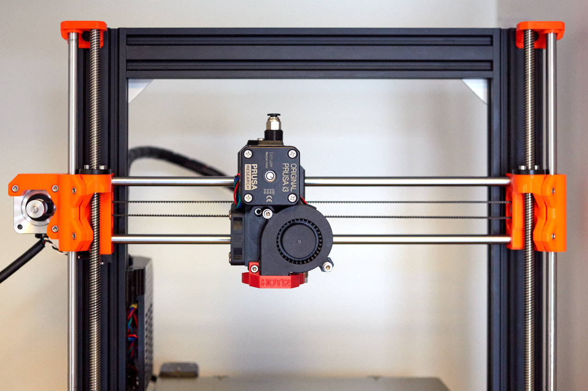

# Bear Extruder And X Axis

## Introduction

This is a better extruder and X axis for Prusa i3 printer MK2.5s and MK3s. It is a following of the [Bear Upgrade project](https://github.com/gregsaun/prusa_i3_bear_upgrade) and is still compatible with original Prusa's 3D printers.

The main goal of this extruder is to improve print quality, reliability and make maintenance easier.

## Features

Here is a list of improved features over stock Prusa extruder.

1. Improve print quality: 
   * Better hotend cooling to reduce clog, heatcreap and stringing (also check these [recommended hotend fans](optional_parts/hotend_fan))
   * Filament path is aligned according to Bondtech specifications (check [this issue](https://github.com/prusa3d/Original-Prusa-i3/issues/51))
   * Extruder body is stiffer to reduce vibration from Bondtech gears
   * Reduce flexing of X axis
   * Self-centring of extruder motor
   * Extruder is closer to X rods to reduce the lever arm
   * Bondtech drive gears closer to motor
   * Includes hotend collet clip to eliminate the risk of the PTFE moving during retractions
   * Extruder shape and nozzle fan duct are makes part cooling more efficient
   * Belt path moved closer to top to reduce lever arm for smoother movements
   * Optional: X end idler for E3D Gates idler

1. Easier to maintain: 
   * No need to disconnect cables from RAMBo to disassemble the extruder or access the belt
   * Z bearings installation made easier thanks to clamps
   * Simple and precise belt tensioning system with 3mm of adjustment
   * Improved extruder body and cover assembly
   * No zip ties needed for X carriage bearings
   * Less screws

1. Improve reliability:
    * Parts designed to last
    * Better heat management
    * Vertical print fan
    * Reduce possible twist on X axis
    * Reduce chance of bad bearing alignment
    * Less screws
    * Extruder body in one piece

1. Support Prusa MMU2S multi color system via the work of vertigo235: [thingiverse.com/thing:3472911](https://www.thingiverse.com/thing:3472911)
1. Support Bondtech Prusa Upgrade extruder
1. Several official and community optional parts
1. No firmware modification required
1. Open source by providing STL and Autodesk Fusion 360 files (STEP file will come later)

## Status

:warning: This is an ongoing development, use it with care. Any feedback is very welcome :relaxed:

## Download printed parts
  * Thingiverse: https://www.thingiverse.com/thing:3226689
  * This GitHub: [printed_parts/stl](printed_parts/stl/)

## Manual

The manual contains bill of material (BOM), print settings and assembly instructions.

[Read the manual here](manual/)

## Optional parts

Official and community optional parts [are here](optional_parts)

## Compatibility

The Bear extruder and X axis is compatible with:
  * Original Prusa MK2.5s printer
  * Original Prusa MK3s printer
  * Bear Upgraded MK2.5(s) frame
  * Bear Upgraded MK3(s) frame
  * Bondtech Prusa extruder upgrade MK2(s), MK2.5(s) and MK3(s) (check [optional parts](optional_parts))

:warning: This extruder and x-ends are matched to each other and __cannot be used separately__. The extruder is __NOT__ compatible with stock X axis, neither vice versa.

## Community

Here are the places were the Bear project is the most active. Do not hesitate to ask if you have a question :

* Facebook group : [facebook.com/groups/PrusaBearUpgrade](https://www.facebook.com/groups/PrusaBearUpgrade)
* Discord server of "The 602 Wasteland" community : [discordapp.com/invite/hYUjSnW](https://discordapp.com/invite/hYUjSnW)
* GitHub : [github.com/gregsaun](https://github.com/gregsaun)
* Thingiverse : [thingiverse.com/pekcitron](https://www.thingiverse.com/pekcitron)
* Openbuilds community : [openbuilds.com/builds/prusa-i3-bear-upgrade-v2.6428](https://openbuilds.com/builds/prusa-i3-bear-upgrade-v2.6428/)

## Images

## Support my work

The Bear project is made possible thanks supporters. Here are some way to support me:
  - Become my patron with Patreon: [patreon.com/gregsaun](https://www.patreon.com/gregsaun)
  - A tip via Paypal: [paypal.me/gregsaun](https://www.paypal.me/gregsaun)
  - A tip via Thingiverse: [thingiverse.com/pekcitron](https://www.thingiverse.com/pekcitron/about)
  
Big thank you in advance :heart:

## Thank you

Thank you to all my Patreon : Sleene, Matthew Humphrey, Greg3D, Robert Veline, Loïc Dumont, Keith Beaul, Stefan Hilbrich, Gareth Brown, Skyler Weinkauf, Grigori Palamartšuk, Stanislav Kljuhhin, Evan, SamE0717, Peter Boardman, Jimmy Lee, Erich Jermann, Miguel Castillo, Scott Rini, Anders Svendsen, Arnaud CHRISTEL, Edward Wright, David Tyra, mark smith, Andrew Bingham, Lewis Cheek, Brian Tibbetts, Mike Phelps, Kevin Smith, Schwiizer, Ted Rathkopf, JTa, flobler, Jonathan Ryer, Nathan Trop, Ryan Lobbins, Corey Dryja, Bearpaw93, David Pesce, RC-CnC, Joshua Jones, Richard Bateman, Christopher Lee, Josh Carter, Cristian Toma, Orlando E Moran, Tomáš Vydra, Hector Gonzalez, Ahmed, Patch Best, Tyler Townes, QcRetro, Joel Weinberg, ra100, Steven Daglish, 3DPrintronics, Darren Furniss, Daniele Malinconi, Warren Schultz, Joseph Quan, Jeremy, Staffsmith aka Thorben Plath, Stephen Pope, Andre, Austin Vojta, Thom Sturgill, Chris Warkocki, Bojan Kopanja, Garth Clardy, Pierre Allegraud, Joan Torner Corrons, Jason Marcus, Albe Gouws, Stephan Kohls, Doug Palmer, Total Dramatist, Apton Ika, Moody Wood Carving, Espen Fjellvær Olsen, Christos Goulas

Thank you to all that have send me a tip on Thingiverse and PayPal.

Thank you to everybody from Facebook group and The 602 Wasteland community.

Thank you for having purchased a kit from an official distributor.

Thank you to all official distributors for taking care of the kits and customers.

Thank you Jason from LDO Motors for the quality manufacturing and relationship.

Thank you Openbuilds for your hardware, community and state of mind.

Thank you for making the community alibe with all your comments, issues, pull requests, optional parts, make, pictures, etc.

Thank you to David Ogles, Flobler, Jason from LDO Motors, Matthew Humphrey, Nathan Denkin, Orlando from All3DMakers, Sleene, Termlimit, Vertigo295 for helping me developing the Bear project.

## Credit, sources and inspiration

Here is a list of sources and inspiration :

* Prusa : http://www.prusa3d.com
* Zaribo : http://zaribo.org
* Vecko Kojchevski : https://www.thingiverse.com/vekoj/designs
* Arnaud Rousseau for "its X-Ends clamped MK3 (Zaribo)" : https://www.thingiverse.com/thing:2964026
* Prusa i3 Solidworks parts from jzkmath : https://github.com/jzkmath/Original-Prusa-i3
* Prusa MK2/S X-Carriage Adjustable Tensioner by Jon Madden : https://www.thingiverse.com/thing:2770019
* Jan Imrich from [Kurzy Kocour](https://www.facebook.com/KurzyKocour/) maker space for all it's hard work on inconsistency issue
* The 602 Wasteland Discord server
* [RH_Dreambox](https://www.thingiverse.com/RH_Dreambox/about) and [Robrps](https://www.thingiverse.com/robrps/designs) for their nozzle fan duct designs

Huge thanks to these projects, without them this project can not exist!
