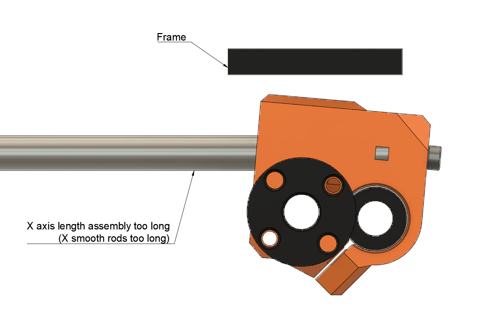
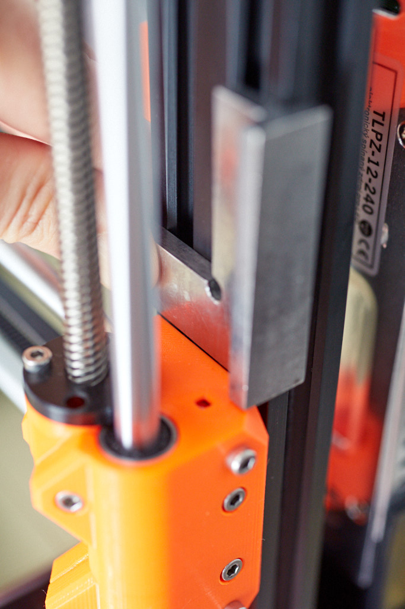

This explains how to adjust the rod tensioning screws on the x end idler. It also discusses the limits of Prusa’s X axis design.

Those screws were present on the MK2s but were removed on the MK3, perhaps making it simpler for the user and to reduce cost. However, while not obvious, those screws can play a critical role.

Due to manufacturing tolerances, user assembly and somewhat flexible printed parts (especially PETG), the X axis length between the Z axis smooth rods will differ between assemblies, for both Bear and original Prusa printers.

This first picture shows an exaggerated view of what is happening when tensioning the belt with too short X smooth rods.

This second picture shows when the X smooth rods are too long.

These rotations of the X end idler around the Z axis result because the ends X smooth rods are not aligned with the Z axis generating a torque that twists the X end idler. The rod tensioning screws can be used to reduce that torque. 

The third picute shows when the tensioning screw are correctly set, the X end idler is parallel to the frame

A good way to check if the X end idler is parallel is to use a machinist square like it this picture.

Usually, the pairs of smooth rods have the same length; in that case, both rod tensioning screw heads should stick out of the X end idler by the same distance that could be verified by a caliper.

However, with Prusa’s design, the X axis and Z axis interact. If the distance between the X end idler and the X motor is too large, the Z rods would be pushed apart, and you would see that the Z rods off-center in with respect to the Z tops. Similarly, if the distance between the X end idler and the X motor is too small, the Z rods would be pulled together. The trapezoidal lead screw nut has some play and can influence this. The screws securing both trapezoidal nuts should be loosened while the X axis is being adjusted. All these interactions makes a perfect assembly almost impossible to achieve.