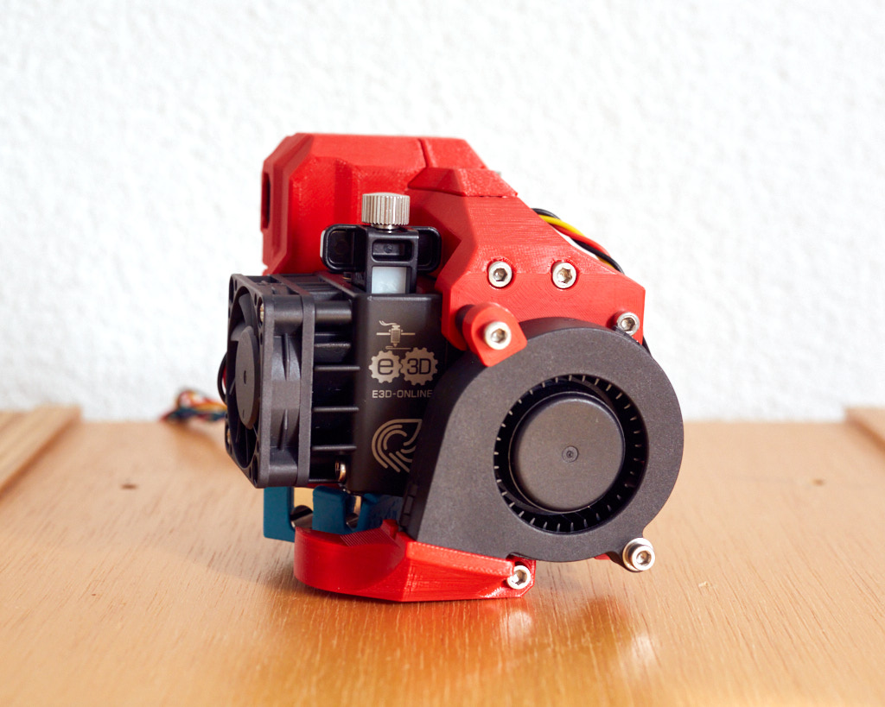

# Bear X axis and Extruder

## BearMera for E3D Hemera extruder

### Table of contents
  1. [Introduction](#introduction)
  1. [Compatibility](#compatibility)
  1. [Bill Of materials](#bill-of-materials)
  1. [Printed parts](#printed-parts)
  1. [Print settings](#print-settings)
  1. [Assembly guide](#assembly-guide)
  1. [Optional parts](#optional-parts)
  1. [Source](#source)
  1. [Thank you](#thank-you)
  1. [Credit and inspiration](#credit-and-inspiration)

### Introduction

This page contains all the files and information to use the Bear X axis with the original [E3D Hemera](https://e3d-online.com/e3d-hemera).

The Hemera needs a dedicated mount to be used with the Bear X axis. All hardware and printed parts needed are available in the [Bill of Materials](#bill-of-materials) section below.

Note: The BearMera reduces a little the print surface to 205x240mm (compared to 210x250mm for Original Prusa).

### Compatibility

The BearMera has a smaller print surface compared to the Original Prusa, Bear and Bondtech extruders: 205x240mm for BearMera, 210x250mm for Bear extruder.

The BearMera is compatible with Original Prusa as well as Bear frame. You must use the Bear X axis in both cases.

This BearMera is only compatible with the Bear X axis.

This BearMera is **NOT** compatible with the original Prusa X axis.

You will need to replace **all** printed parts if you are already using the Bear X axis (with another extruder) of version **equal or smaller than 0.7.0-beta**.

### Bill Of materials

#### Hardware BOM for Original Prusa printers

This is the list of extra material you will need from original Prusa extruder and X axis.

| Part     | Quantity (pce) | Detail | Example Link |
|----------|:---------------:|----------|--------------|
| E3D Hemera                             | 1 | | [E3D-Online store](https://e3d-online.com/e3d-hemera) |
| Hotend fan                             | 1 | Stock Hemera fan or higher specifications (yet unknown) | |
| M3x8mm socket head screw (ISO 4762)    | 3 | Check your Hemera package | [McMaster-Carr](https://www.mcmaster.com/90751a111) | |
| M3x10mm socket head screw (ISO 4762)   | 12 | | [McMaster-Carr](https://www.mcmaster.com/#91292a113/=1coixe5) | |
| M3x18mm socket head screw (ISO 4762)   | 16 | | [McMaster-Carr](https://www.mcmaster.com/#91292a029/=1coixwt) | |
| M3x25mm socket head screw (ISO 4762)   | 2  | | [McMaster-Carr](https://www.mcmaster.com/#91292a020/=1cok8ux) | |
| M3x40mm socket head screw (ISO 4762)   | 3  | | [McMaster-Carr](https://www.mcmaster.com/#91292a024/=1coj8pe) | |
| M2x12mm socket head screw (ISO 4762)   | 2  | :warning: MK2(S) or MK2.5(S) only | [McMaster-Carr](https://www.mcmaster.com/#91292a834/=1cok8m8) |
| M3 Hex nylock nuts (DIN 985)           | 3  | | |
| M3 Hex nuts (DIN 934)                  | 15 | | |
| M3 Square nuts (DIN 562)               | 6  | 1.8mm thick and 5.5mm wide | |
| M3 Steel washer (DIN 125), 0.5mm thick | 1  | | |
| Zip ties 2.5x100mm                     | 5  | | |
| Dowel pin diameter: 3mm, length: 15mm to 15.8mm | 1 | Must fit the 2GT idler bearing. :pushpin: Cut a M3 screw if you can't find one |

#### Additional BOM for scratch build

| Part     | Quantity (pce) | Detail | Example Link |
|----------|:---------------:|----------|--------------|
| Nema 17 stepper for X axis LDO 42STH38-1004A100CM | 1 | [Datasheet](https://github.com/gregsaun/bear_extruder_and_x_axis/tree/master/doc/datasheets/LDO-42STH38-1004A100CM-RevA-for-3D.pdf?raw=true) | [Prusa](https://shop.prusa3d.com/en/mk3mk3s/388-x-axis-stepper-motor.html) |
| Nema 17 stepper for Z axis integrated Lead screw Tr8x8 (P2x4) and nut LDO-42STH34-1004L321E100CM | 2 | [Datasheet](https://github.com/gregsaun/bear_extruder_and_x_axis/tree/master/doc/datasheets/LDO-42STH34-1004L321E100CM-RevA-for-3D.pdf?raw=true) | [Prusa](https://shop.prusa3d.com/en/spare-parts/386-stepper-motor-z-axis-right.html) |
| Nozzle Fan | 1 | Minimal specifications: - CFM: 3.8 - Static Pressure: 11.3 mmH2O - Bearing type: ball bearing | [Prusa](https://shop.prusa3d.com/en/spare-parts/201-print-fan.html) |
| Inductive Sensor | 1 | Diameter of 8mm, length around 35mm | | [Prusa](https://shop.prusa3d.com/en/spare-parts/200-pinda-probe-v2.html) |
| Filament sensor with magnets, steel ball and cables | 1 | 1x IR Sensor: [GitHub Prusa](https://github.com/prusa3d/MKxS-IR-sensor) 1x Steel ball 7mm diameter 1x Magnet 20x6x2 1x Magnet 10x6x2  | [Prusa](https://shop.prusa3d.com/en/upgrades/898-original-prusa-i3-mk3-to-mk3s-upgrade-kit.html#) |
| 2GT 16T pulley | 1 | 3mm bore  | [E3D-Online store](https://e3d-online.com/gates-powergrip-pulley-16-tooth-6mm) |
| 2GT 20T idler | 1 | 3mm bore smooth or toothed Check this [optional part for E3D idler](https://github.com/gregsaun/bear_extruder_and_x_axis/tree/master/optional_parts/x_end_idler_tensioner_e3d) | |
| Smooth rods | 2 | 8mm diameter H6 370mm long | [Prusa](https://shop.prusa3d.com/en/mk3mk3s/589-smooth-rod-8x370-x-axis-1-piece.html) |
| LM8UU bearings | 3 | [Prusa](https://shop.prusa3d.com/en/mk3mk3s/140-linear-bearing-lm8uu.html) |
| Gates LL-2GT RF belt | 1 | 6mm width 880mm long | [E3D-Online store](https://e3d-online.com/gates-powergripr-gt2-belt-6mm-x-100mm) |
| Nylon cable 2.85-3.00mm diameter 500mm long | 1 | You can use 2.85mm sample or cleaning filaments | |

### Printed parts

Download links for the BearMera and X axis:
  * BearMera and X axis for MK2(S) and MK2.5(S): [bearmera_mk2_mk2s_mk2.5_mk2.5s.zip](printed_parts/bearmera_mk2_mk2s_mk2.5_mk2.5s.zip?raw=true)
  * BearMera and X axis for MK3(S) and MK3(S): [bearmera_mk3_mk3s.zip](printed_parts/bearmera_mk3_mk3s.zip?raw=true)

### Print settings

:warning: Warning: The parts have been designed and tested with the parameters below and it is important to follow them to avoid issues like part cracking, bad bridging, not enough stiffness or wrong tolerances. Be sure to have a well calibrated machine and extruder. Check our guide here for [calibrating extrusion multiplier](https://guides.bear-lab.com/Guide/Extrusion+multiplier+and+filament+diameter/8?lang=en)

  * Slicer : PrusaSlicer recommended
  * Infill type : Gyroid recommended
  * Support : No
  * Brim : No
  * Detect thin walls : No
  * Perimeters width (internal and external) : 0.45mm

| Part | Quantity | Layer Height | Infill | Perimeters | Top/Bottom Layers | Filament Type |
|:----|:----:|:----:|:----:|:----:|:----:|:----:|
| body_back               | 1 | 0.20mm | 20% | 4 | 5 | PETG |
| body_front              | 1 | 0.20mm | 20% | 4 | 5 | PETG |
| cable_cover             | 1 | 0.20mm | 20% | 4 | 5 | PETG |
| nozzle_fan_duct         | 1 | 0.20mm | 20% | 3 | 5 | Read note1 below |
| nozzle_fan_spacer       | 1 | 0.20mm | 20% | 4 | 5 | PETG |
| pinda_mount             | 1 | 0.20mm | 20% | 4 | 5 | PETG |
| ptfe_collet_clip        | 1 | 0.20mm | 20% | 3 | 5 | PETG |
| y_axis_end_stop         | 1 | 0.20mm | 20% | 3 | 5 | PETG |
| x_carriage              | 1 | 0.20mm | 20% | 4 | 5 | PETG |
| x_carriage_back         | 1 | 0.20mm | 20% | 3 | 5 | PETG |
| x_end_idler             | 1 | 0.20mm | 20% | 4 | 5 | PETG |
| x_end_idler_tensioner   | 1 | 0.20mm | 20% | 4 | 5 | PETG |
| x_end_motor             | 1 | 0.20mm | 20% | 4 | 5 | PETG |
| cable_guide_back_a      | 1 | 0.20mm | 20% | 4 | 5 | PETG |
| cable_guide_back_b      | 1 | 0.20mm | 20% | 4 | 5 | PETG |

Note1: The nozzle_fan_duct needs to be printed with a heat resistant filament like ABS, Extrudr GreenTec Pro, annealed HTPLA, PC and probably much more. Don't forget to compensate for shrinkage accordingly to the filament type you are using.

You can find more details about recommended filaments in on our [FAQ](https://guides.bear-lab.com/Wiki/Bear_FAQ).

### Assembly guide

The assembly guide is available on [guides.bear-lab.com](https://guides.bear-lab.com/c/r63d85yfkvrohzf1).

### Optional parts

Here is a list official optional parts for your BearMera.

| Name | Description | Link |
|------|-------------|------|
| E3D Volcano | A body_front to support E3D Volcano | [optional_parts/e3d_volcano](optional_parts/e3d_volcano/) |
| Fan washer | Allow a stronger tightening of the E3D fan by avoiding it to twist | [optional_parts/fan_washer](optional_parts/fan_washer/) |

### Source

All source files in Fusion 360 and STEP format can be [download here](source/bearmera_source.zip?raw=true).

### Thank you

Thank you to [E3D-Online](https://e3d-online.com) for their warm encouragement and for having sponsor this development with a free Hemera.

### Credit and inspiration

  * E3D Hemera Prusa i3 MK2(S) upgrade: https://e3d-online.dozuki.com/Guide/Hemera+Prusa+i3+MK2-2s+upgrade/138?lang=en
