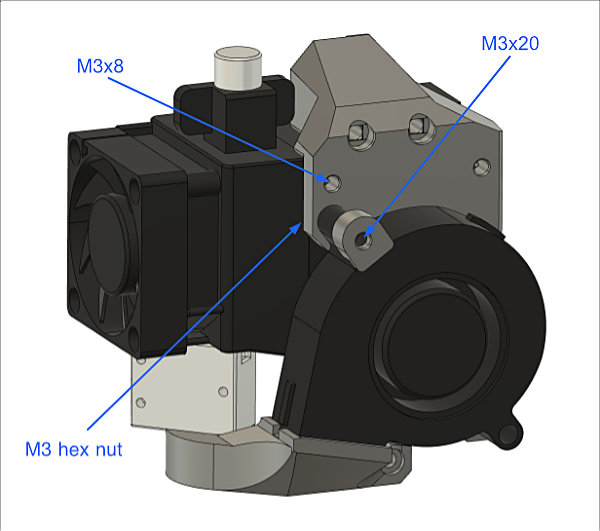

# Bear X axis and Extruder

## E3D Volcano adapter for BearMera

### Table of contents
  1. [Introduction](#introduction)
  1. [Compatibility](#compatibility)
  1. [Bill Of Materials](#bill-of-materials)
  1. [Printed Parts](#printed-parts)
  1. [Assembly Guide](#assembly-guide)
  1. [Credits](#credits)

### Introduction

This is a body_front printed part to use [E3D Volcano](https://e3d-online.com/volcano-block-for-sensor-cartridges) with BearMera.

### Compatibility

This body_front is only compatible with Bear Hemera mount.

### Bill Of Materials

#### Extra hardware from stock BearMera

This is the list of extra material you will need from original Prusa extruder and X axis.

| Part     | Quantity (pce) | Detail | Example Link |
|----------|:---------------:|----------|--------------|
| M3x8mm socket head screw (ISO 4762)    | 1 | For front left Hemera t-nut | |
| M3x20mm socket head screw (ISO 4762)   | 1 | For top screw of nozzle fan | |
| M3 Hex nuts (DIN 934)                  | 1 | | |

### Printed Parts

Download all parts for BearMera and replace body_front.stl by body_front_volcano.stl.

  * Part body_front_voclano for BearMera: [body_front_volcano.stl](printed_parts/stl/body_front_voclano.stl?raw=true)
  * BearMera and X axis for MK2(S) and MK2.5(S): [bearmera_mk2_mk2s_mk2.5_mk2.5s.zip](printed_parts/bearmera_mk2_mk2s_mk2.5_mk2.5s.zip?raw=true)
  * BearMera and X axis for MK3(S) and MK3(S): [bearmera_mk3_mk3s.zip](printed_parts/bearmera_mk3_mk3s.zip?raw=true)

### Print settings

Use same [print settings as BearMera](../../README.md#print-settings)

### Assembly Guide

Follow the BearMera assembly guide but with the E3D Volcano heatblock and the body_front_volcano.stl. Here are where the extra hardware should go:

### Credits

Thank you very much to Flobler for having designed and tested this body_front_voclano part.
