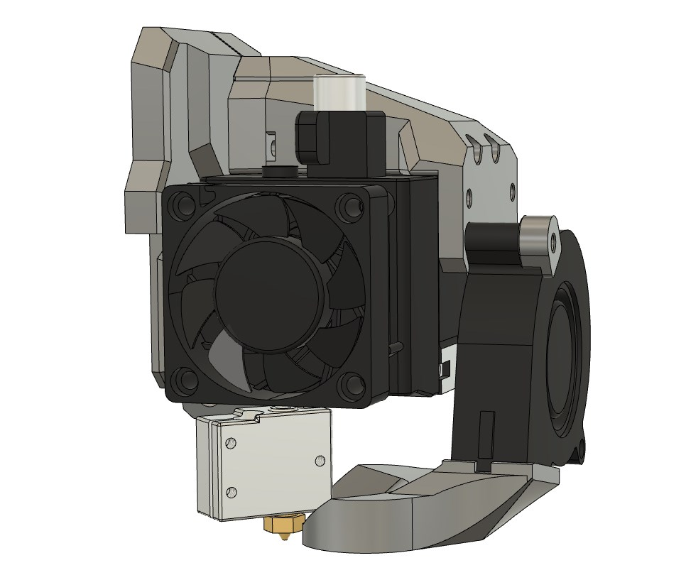

# Bear X axis and Extruder

## E3D Volcano adapter for BearMera

### Table of contents
  1. [Introduction](#introduction)
  1. [Compatibility](#compatibility)
  1. [Bill Of Materials](#bill-of-materials)
  1. [Printed Parts](#printed-parts)
  1. [Assembly Guide](#assembly-guide)

### Introduction

This is a body_front printed part to use [E3D Volcano](https://e3d-online.com/volcano-block-for-sensor-cartridges) with BearMera.

### Compatibility

This body_front is only compatible with Bear Hemera mount.

### Bill Of Materials

#### Extra hardware from BearMera

This is the list of extra material you will need from original Prusa extruder and X axis.

| Part     | Quantity (pce) | Detail | Example Link |
|----------|:---------------:|----------|--------------|
| M3x20mm socket head screw (ISO 4762)   | 1 | For top screw of nozzle fan | |
| M3 Hex nuts (DIN 934)                  | 1 | | |

### Printed Parts

#### Download

Download all part of the BearMera mount with exception of the body_front_voclano.stl which needs to be taken from this page.

#### Print settings

Use same print settings as BearMera

### Assembly Guide

Follow the BearMera assembly guide but with the E3D Volcano heatblock and the body_front_volcano.stl.
