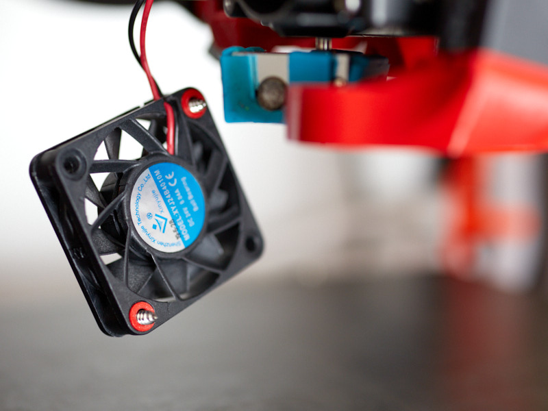
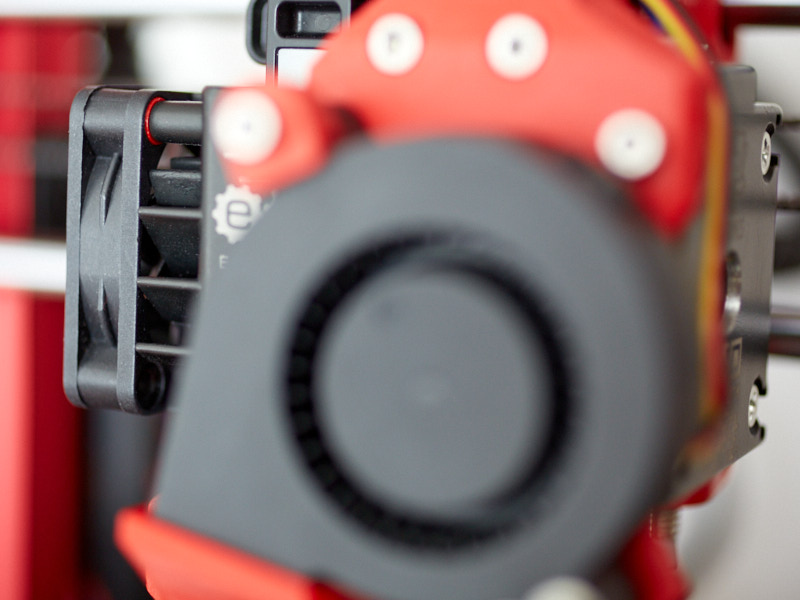

# Bear X axis and Extruder

## Fan washer for BearMera

### Table of contents
  1. [Introduction](#introduction)
  1. [Compatibility](#compatibility)
  1. [Bill Of Materials](#bill-of-materials)
  1. [Printed Parts](#printed-parts)
  1. [Assembly Guide](#assembly-guide)

### Introduction

The original Hemera hotend fan has a tendency to twist if you tighten it too strongly. Those printed washers are solving this issue and let you secure more strongly the Hemera fan.

### Compatibility

Only compatible with Hemera hotend fans that have a counterbore on the back (side of the sicker's fan).

### Bill Of Materials

No extra hardware needed, you can use the original self tapping screws coming with your Hemera.

### Printed Parts

#### Download

Download fan_washer.stl from this page.

#### Print settings

| Part | Quantity | Layer Height | Infill | Perimeters | Top/Bottom Layers | Filament Type |
|:----|:----:|:----:|:----:|:----:|:----:|:----:|
| fan_washer   | 2 | 0.20mm | not relevant | 2 | 5 | PETG |

### Assembly Guide

Place one washer on each fan mounting screws. The washers should be on the back side of the fan, where the sticker is.
