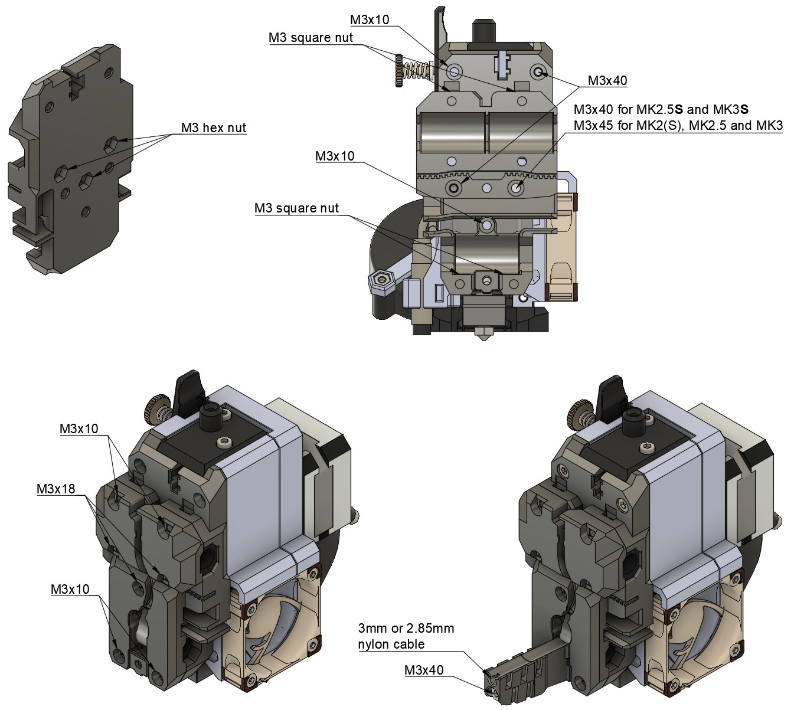
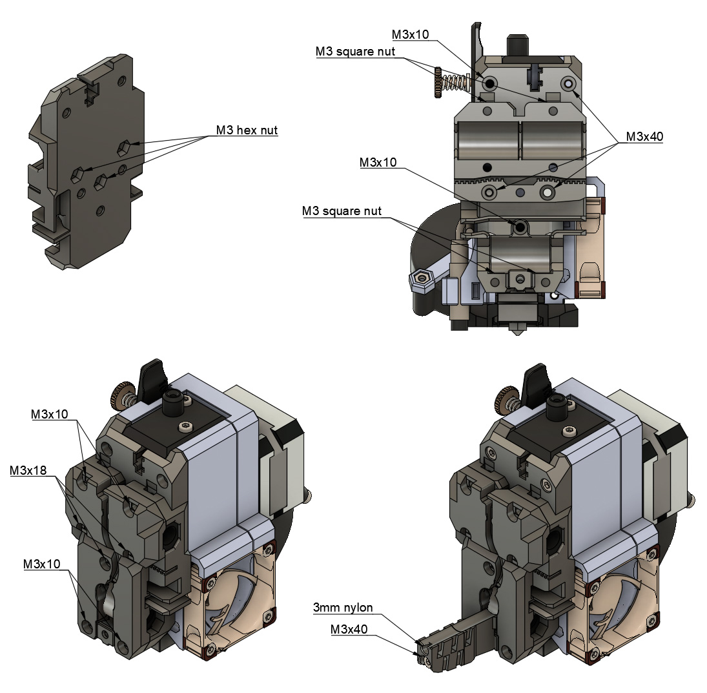

# Bear X axis and Extruder

## Bondtech Prusa Upgrade Extruder

### Introduction

I had the chance to work with Bondtech on the [Bondtech Prusa Upgrade Extruder](https://www.bondtech.se/en/product-category/upgrade-kits/prusa/) and with some other guys from [Prusa community](https://www.facebook.com/groups/prusacommunity/). I helped them to ensure this extruder will not suffer from exaggerated inconsistent extrusion (called issue 602) of original Prusa extruders (including R3). As bonus, Bondtech made this extruder compatible with Bear X axis and open source!

You will need a special X carriage for MK2.5 and MK3 to mount the Bondtech Prusa Upgrade Extruder on the Bear X axis.

The Bear X axis improves print quality, reliability and ease of use compared to original Prusa axis. It is stiffer, improved belt path and tensioning system, has much better easier way to manage cables/belts on the back of the carriage and reduce the bending of motor's shaft.

In order to be sure exaggerated inconsistent extrusion is cured with this extruder I highly recommend to use the [Sunon fan](../hotend_fan).

### Bill of Materials

This is the list of extra material you will need from original Prusa extruder

| Part     | Quantity (pce) | Detail |
|----------|:---------------:|--------|
| Bondtech Prusa Upgrade Extruder and Motor | 1 | |
| Dowel pin diameter: 3mm, length: 15mm to 15.8mm | 1 | Must fit the 2GT idler bearing. :pushpin: Cut a M3 screw if you can't find one |
| M3 Hex nylock nuts (DIN 985) | 2 | |
| M3 Hex nuts (DIN 934) | 3 | |

### Printed Parts

You can download the bondtech_x_carriage_mkX.stl from in the current page [here](printed_parts/) and the other parts come from the main parts [here](../../printed_parts/stl).

* Filament type : PETG
* Infill type : Gyroid recommended
* Support : No
* Brim : No
* Detect thin walls : No

| Part | Quantity | Layer Height | Infill | Perimeters | Top/Bottom Layers |
|:----|:----:|:----:|:----:|:----:|:----:|
| bondtech_x_carriage_mkX.stl | 1 | 0.20mm | 20% | 3 | 5 |
| x_end_idler                 | 1 | 0.20mm | 20% | 4 | 5 |
| x_end_idler_idler_mount     | 1 | 0.20mm | 20% | 4 | 5 |
| x_end_motor                 | 1 | 0.20mm | 20% | 4 | 5 |
| cable_guide_back_a          | 1 | 0.20mm | 20% | 4 | 5 |
| cable_guide_back_b          | 1 | 0.20mm | 20% | 4 | 5 |
| x_carriage_back             | 1 | 0.20mm | 20% | 3 | 5 |

### Assembly Guide

Follow the assembly guide from Bondtech and this one for the X axis and carriage

