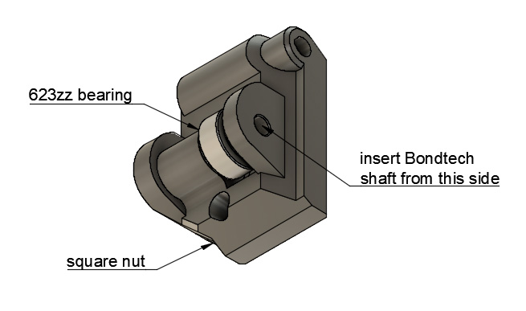

# Bear X axis and Extruder

## Extruder idler with bearing

### Introduction

When filament is running between Bondtech gears, the gearwheel are touching at the very ends of their teeth. This might introduce a non smooth rotation of the Bondtech "idler" gear and might result in inconsistent extrusion.

This optional extruder idler replaces the Bondtech "idler" gear by a 623zz bearing to eliminate this issue.

### Bill of Materials

| Part     | Number (pce) | Detail |
|----------|:---------------:|--------|
| Bear extruder | 1 | |
| 623zz Bearing | 1 | I.D.: 3mm, O.D.: 10mm, width: 4mm |
| Bondtech shaft | 1 | |
| Dowel pin diameter: 3mm, length: 14mm to 20mm | 1 | Need to fit the 623zz bearing. Cut a M3 screw if you cannot find it | [McMaster-Carr](https://www.mcmaster.com/#93600a364/=1dbmkt6) |

### Printed Parts

* Filament type : PETG
* Infill type : Gyroid recommended
* Support : No
* Brim : No

| Part | Quantity | Layer Height | Infill | Perimeters | Top/Bottom Layers |
|:----|:----:|:----:|:----:|:----:|:----:|
| extruder_idler_bearing  | 1 | 0.20mm | 20% | 4 | 5 |

### Sources

Source file is available in the extruder source here : [root/src](/src)

### Assembly

