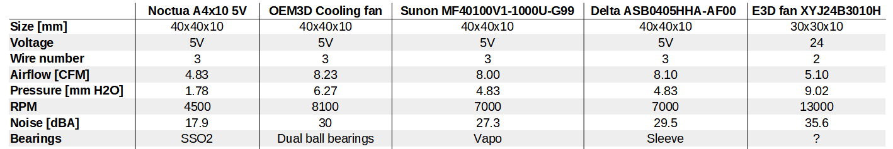
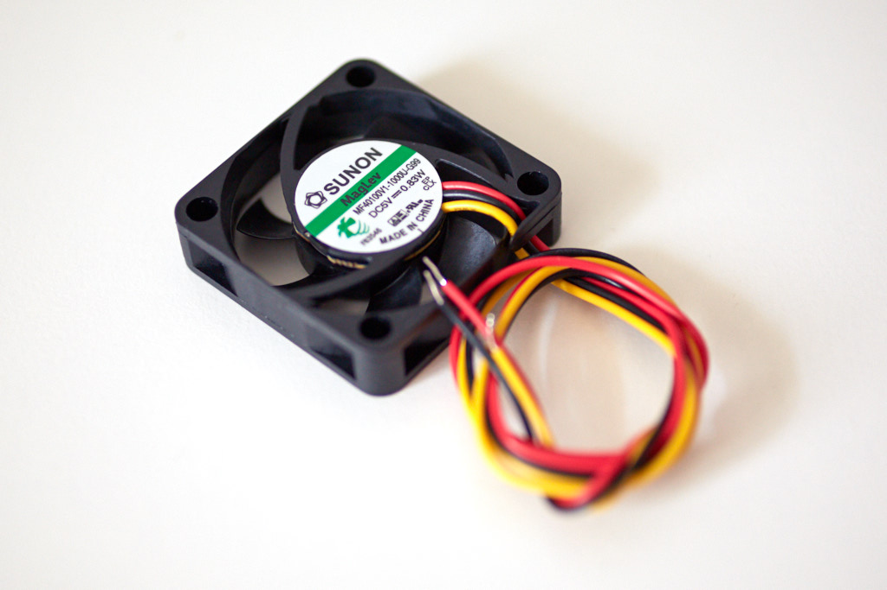
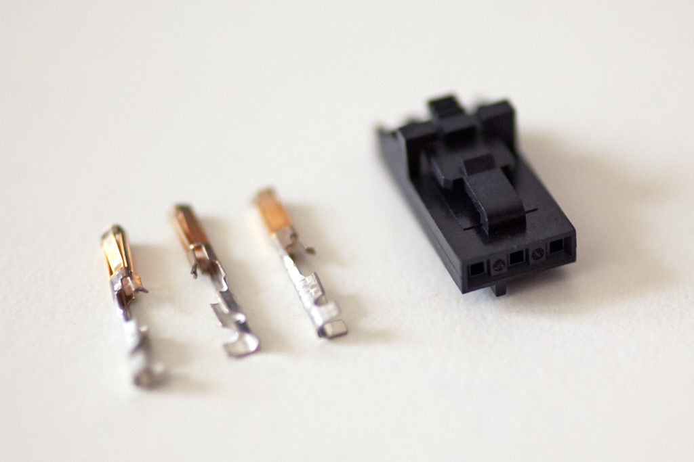

# Bear X Axis And Extruder

## Upgrade of Noctua hotend fan

The Noctua fan used by Prusa is designed to cool down a case, not a heatsink. The Bear extruder is making the Noctua more efficient but it is still not powerful enough. The Noctua is lacking static pressure to pass through the fins of the heatsink and to avoid back pressure due to the "reduction cone" to match the E3D v6 heatsink size.

Fortunately, there is *almost* a drop-in replacement for the Noctua from Sunon or Delta which are more powerful but more noisier (you cannot get more pressure with same noise level...) :
  * Sunon MF40100V1-1000U-G99
  * Delta ASB0405HHA-AF00 

Some distributors are selling the Sunon with correct cable length and connector. However, you could source on your own and solder a longer cable and crimp a connector. The total cable length needs to be 700mm long. I recommend AWG 26 wire. Connector used on the RAMBo is Molex SL 70066 and contacts are Molex SL 70058.

You will need M3x14mm button head or flat head screw otherwise it might enter in contact with Z lead screw.

