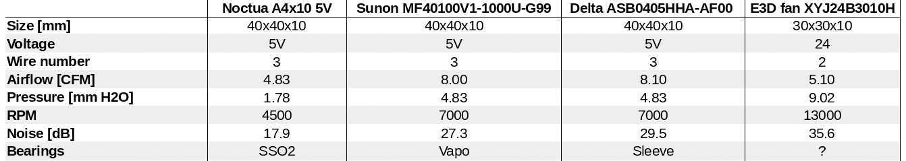

# Bear X Axis And Extruder

## Sunon to replace Noctua

The Noctua used by Prusa is not made to cool down a hotend (check here for more details : [Hotend Cooling Issues](http://prusaowners.com/wiki/index.php?title=How_to_make_prints_better_on_the_mk3#Hotend_Cooling_Issues)). Even if the Bear extruder is making the job easier for the Noctua it still not good enough.

To pass through the heatsink you need static pressure and the Noctua does not have enough. On bigger Noctua fan you can see that some are specially designed to have more pressure to pass through CPU coolers.

Fortunately, there is *almost* a drop-in replacement for the Noctua from Sunon which is way more powerful but more noisier (you cannot get pressure with same noise level...) :
Sunon MF40100V1-1000U-G99

I said *almost* drop-in because you will need to solder a longer cable and crimp a connector, which is not always easy to do (specially crimping). The total cable length needs to be 700mm long. I recommend AWG 26 wire.

Connector used on the RAMBo is Molex SL 70066 and contacts are Molex SL 70058.

You will need M3x14mm button head or flat head screw otherwise it might enter in contact with Z lead screw.

