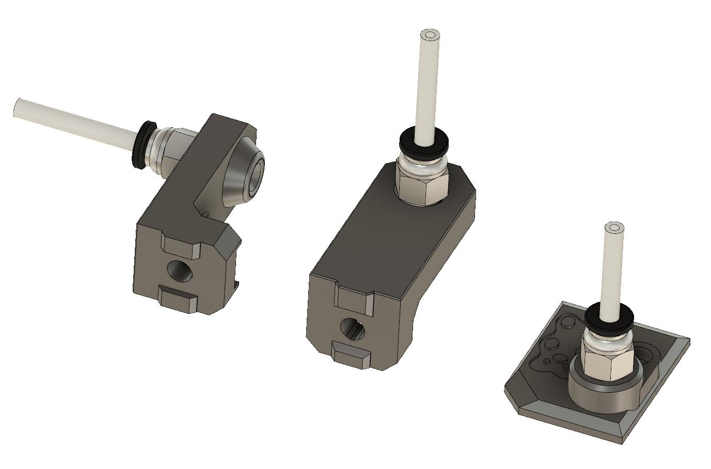
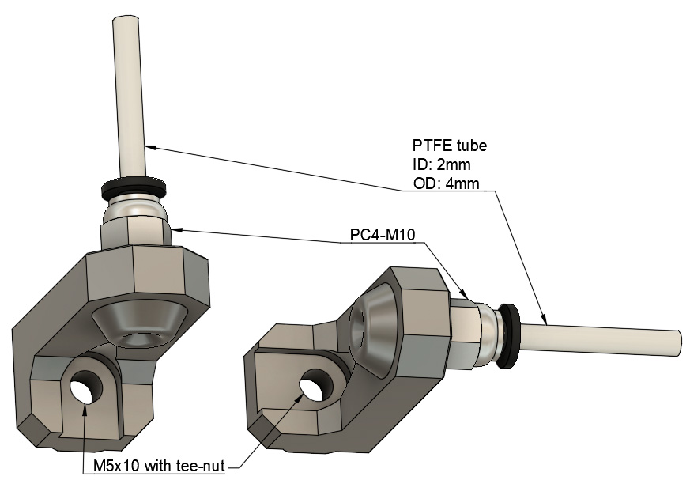
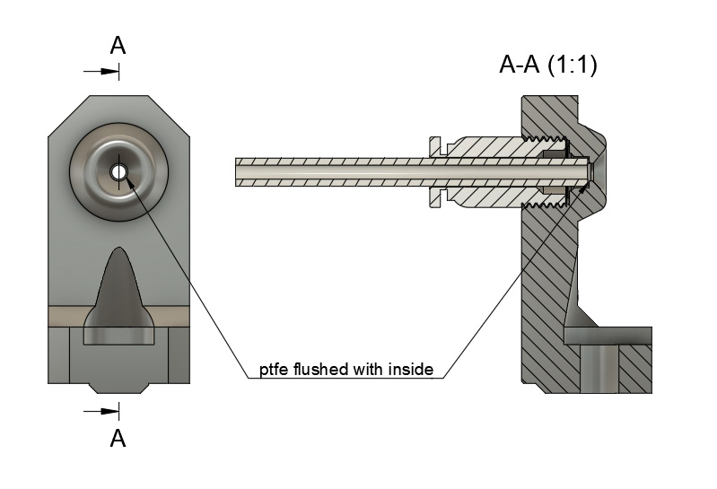
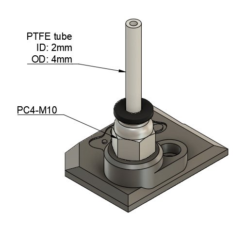

# Bear X axis and Extruder

## Reverse Bowden

### Introduction

Reverse bowden as the advantage to reduce vibration and tension from the spool holder. The PTFE will imply a smoother movement of the filament (and spool holder) and so improve print quality.

The filament sensor cover can be used alone for MMU2.

The vslot mount is available in two versions: angled or normal.

### Bill of Materials

| Part     | Number (pce) | Detail |
|----------|:---------------:|--------|
| Bear extruder and x axis| 1 | |
| PC4-M10 fitting | 2 | |
| PTFE tube | 1 | ID: 2mm, OD: 4mm |
| M5x10 screw | 1 | |

### Printed Parts

* Filament type : PETG
* Infill type : Gyroid recommended
* Support : No
* Brim : No
* Detect thin walls : No

| Part | Quantity | Layer Height | Infill | Perimeters | Top/Bottom Layers |
|:----|:----:|:----:|:----:|:----:|:----:|
| filament_sensor_cover_pc4-m10.stl | 1 | 0.20mm | 20% | 3 | 5 |
| vslot_mount_pc4-m10.stl | 1 | 0.20mm | 20% | 3 | 5 |
| vslot_mount_pc4-m10_angled.stl | 1 | 0.20mm | 20% | 3 | 5 |

### Assembly

1. You need to replace the filament sensor cover by the one included here
1. Attach the vslot mount of your choice to the frame
1. Add the two PC4-M10 fittings
1. Cut the PTFE at the correct length
1. Insert the PTFE tube inside both PC4-M10 (be sure that the PTFE is fully inserted inside the vslot mount)

