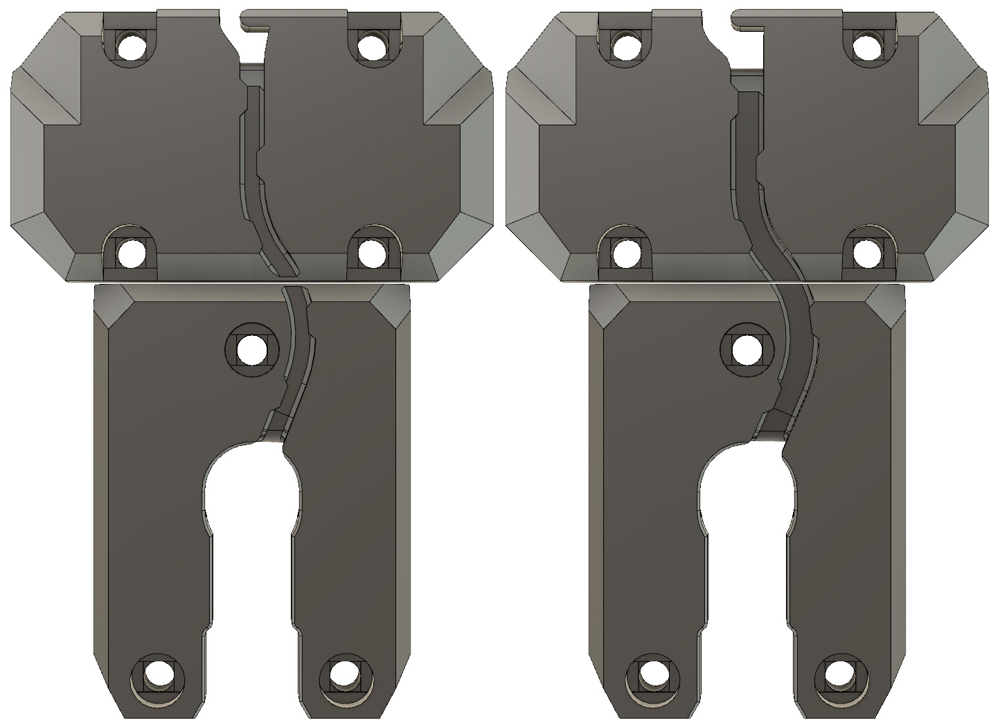

# Bear X Axis And Extruder (BearExxa)

## X carriage back for larger filament sensor cable

This is a remix of the original Bear extruder X carriage back to allow use of larger cables like the MK2.5/MK3 laser filament sensor cable (for [Bondtech X carriage](../bondtech_x_carriage) for example).

Left is standard X carriage back and right is the larger one proposed here.

Use the links below to download the STL:
  * For MK2.5(S): [x_carriage_back_mk2.5_larger_cable.stl](printed_parts/x_carriage_back_mk2.5_larger_cable.stl?raw=true)
  * For MK3(S): [x_carriage_back_mk3_larger_cable.stl](printed_parts/x_carriage_back_mk3_larger_cable.stl?raw=true)

  
